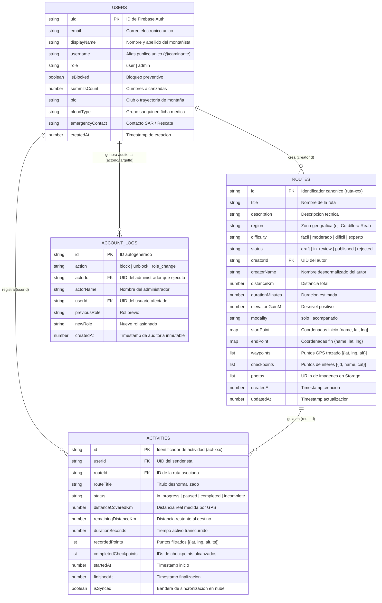
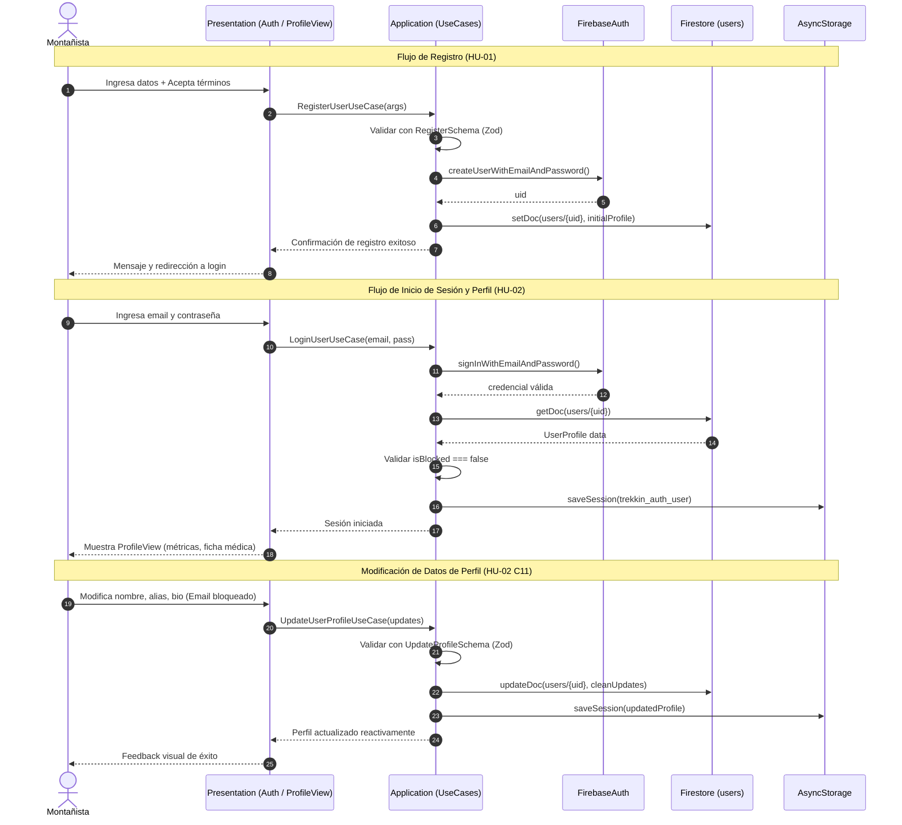
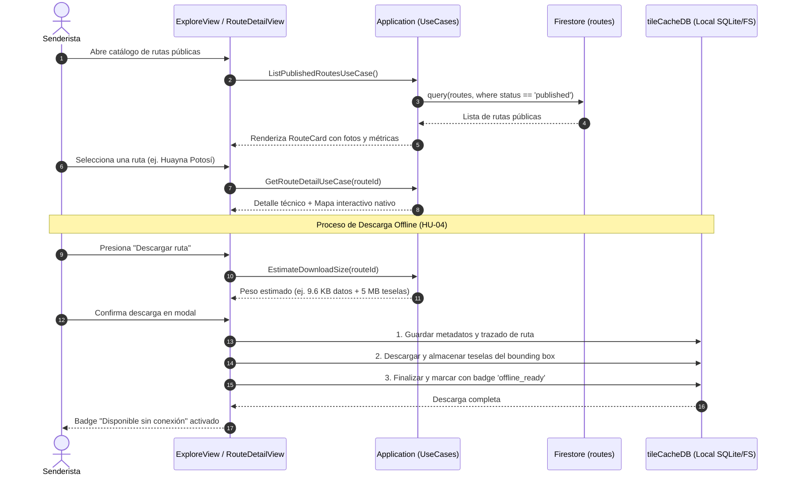
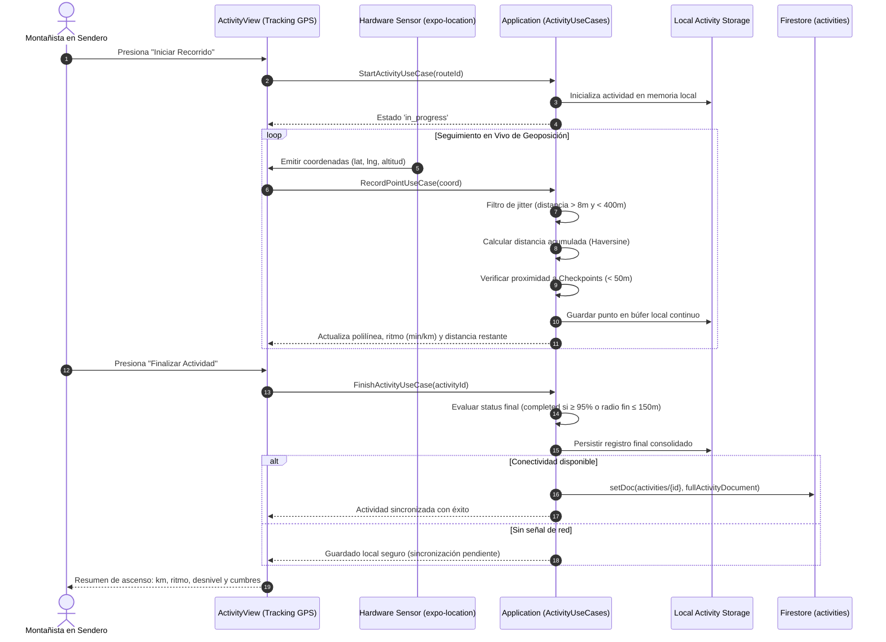
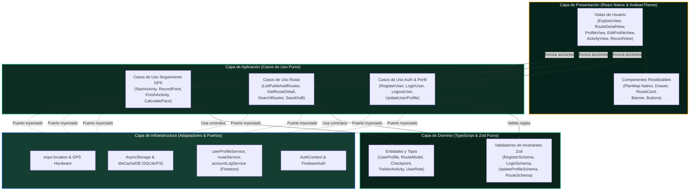

# INFORME TÉCNICO Y PITCH DE PRESENTACIÓN — TREKKIN APP (PROYECTO TREK-BOLIVIA PRO)

> **Documento Maestro de Presentación para Clientes y Stakeholders**  
> Plataforma Móvil Nativa de Senderismo, Alpinismo y Seguridad en Montaña  
> **Stack Tecnológico:** React Native · Expo SDK 57 · TypeScript Strict · Clean Architecture · Google Cloud Firestore · Zustand · AsyncStorage / SQLite

---

## 1. Resumen Ejecutivo y Pitch de Presentación

### 1.1. El Problema en el Terreno
En Bolivia, la práctica del senderismo y montañismo en la Cordillera Real y valles interandinos enfrenta dos barreras críticas:
1. **Pérdida absoluta de conectividad móvil:** El 90% de las rutas de media y alta montaña carecen de cobertura celular. Las aplicaciones tradicionales fallan al requerir servidores web para cargar mapas y geolocalización.
2. **Seguridad y rescate precarios:** No existe una plataforma centralizada que consolide trazados técnicos verificados, waypoints de agua/refugio, métricas de desnivel y datos médicos básicos de los senderistas en caso de emergencia.

### 1.2. La Solución: Trekkin App
**Trekkin App** es una aplicación móvil nativa diseñada desde sus cimientos para operar bajo la filosofía **Offline-First**:
* **Cartografía 100% Nativa sin Conexión:** Motor Slippy Map propio sin WebViews lentas, con teselas precargadas de La Paz y la Cordillera Real y descarga selectiva de mapas en memoria local.
* **Trazabilidad y Métricas Reales:** Medición de distancia geodésica (fórmula de Haversine), ritmo por kilómetro, velocidad media y desniveles acumulados en tiempo real.
* **Arquitectura Limpia y Confiable:** Independencia del framework mediante **Clean Architecture**. Si la conexión a internet cae o el servidor se degrada, la app almacena todo el recorrido localmente y lo sincroniza de manera resiliente al volver a tener señal.
* **Seguridad Estricta:** Control de acceso por roles (`user` y `admin`), auditoría inmutable de acciones administrativas y protección de identidad del montañista.

---

## 2. Historias de Usuario con Criterios de Aceptación (DoD & GIVEN-WHEN-THEN)

### HU-01: Registrar Cuenta
* **Rol:** Visitante (usuario no autenticado).
* **Narrativa:** **Como** nuevo montañista **quiero** registrar una cuenta con mis datos personales y credenciales **para** acceder a las funciones protegidas de la aplicación y personalizar mi perfil.
* **Criterios de Aceptación:**
  * **C1 — Formulario obligatorio:** Exige Nombre Completo (mín 3 caracteres), Email válido, Nombre de Usuario/Alias (sin `@`, alfanumérico), Contraseña (mín 8 caracteres), Confirmación idéntica y Aceptación obligatoria de Normas de Seguridad en Montaña.
  * **C2 — Rol inicial:** Toda cuenta se crea con rol `user`, `isBlocked: false` y `summitsCount: 0`.
  * **C3 — Prevención de duplicados:** Detección y rechazo de correos ya existentes en Firebase Auth.
  * **C4 — Flujo post-registro (GIVEN-WHEN-THEN):**
    * **GIVEN:** Un visitante llena el formulario con datos válidos.
    * **WHEN:** Presiona "Crear Cuenta".
    * **THEN:** El sistema crea la cuenta en Firebase Auth, almacena el perfil en Firestore `users/{uid}`, muestra confirmación de éxito y redirige a Iniciar Sesión sin dejar sesión automática espuria.

---

### HU-02: Iniciar Sesión, Consultar Perfil y Modificar Datos
* **Rol:** Usuario registrado / Administrador.
* **Narrativa:** **Como** usuario registrado **quiero** iniciar/cerrar sesión, consultar mi ficha de montañista y actualizar mis datos **para** resguardar mi sesión y mantener al día mi identidad y ficha médica.
* **Criterios de Aceptación:**
  * **C1 — Autenticación y bloqueo preventivo:** Validación con `LoginSchema`. Si `isBlocked === true`, el acceso se deniega inmediatamente ("Tu cuenta se encuentra suspendida").
  * **C2 — Discriminación de fallas:** Distinción técnica entre credenciales erróneas y fallas de red (`isNetworkError`).
  * **C3 — Ficha de Perfil (`ProfileView`):** Muestra Avatar, Nombre, `@username`, badge de rol (`SENDERISTA` / `ADMINISTRADOR`), barra de métricas (Cumbres, Km Totales, Rutas Grabadas) y datos médicos informativos (Grupo Sanguíneo y Contacto SAR).
  * **C4 — Modificación de Datos (`EditProfileView`):**
    * Permite modificar `displayName` (mín 3 letras), `username` (normalizado), bio, grupo sanguíneo y contacto rescate.
    * **Inmutabilidad de Correo:** El email es de solo lectura (protege la integridad de Firebase Auth).
    * **Privacidad de Celular:** El número telefónico no se almacena en el modelo ni en base de datos.
  * **C5 — Cierre seguro:** `signOut` purga la clave local `trekkin_auth_user` en AsyncStorage y retorna a visitante.

---

### HU-03: Explorar y Consultar Catálogo de Rutas Públicas
* **Rol:** Visitante / Senderista autenticado.
* **Narrativa:** **Como** senderista **quiero** buscar y consultar rutas técnicas con trazado interactivo y puntos de interés **para** conocer la dificultad, distancia y tiempo estimado antes de salir a la montaña.
* **Criterios de Aceptación:**
  * **C1 — Acceso libre (Guest):** Catálogo y detalle accesibles sin obligación de registro.
  * **C2 — Filtros reactivos:** Búsqueda textual por nombre/región y filtro por dificultad (`Fácil`, `Moderado`, `Difícil`, `Experto`).
  * **C3 — Ficha técnica de detalle:** Desglose de distancia (km), tiempo estimado, desnivel positivo (`+XX m`), modalidad (`Solo` / `Acompañado`) y lista de checkpoints (agua, campamentos, pasos técnicos).
  * **C4 — Visualización cartográfica:** Renderizado en mapa nativo sin conexión mediante polilíneas SVG y marcadores geográficos.

---

### HU-04: Descarga de Rutas y Teselas Offline
* **Rol:** Senderista autenticado.
* **Narrativa:** **Como** senderista que viaja a zonas sin cobertura celular **quiero** descargar la ficha técnica y el cuadrante de mapa de una ruta **para** navegar con seguridad en modo avión.
* **Criterios de Aceptación:**
  * **C1 — Estimación de peso:** Cálculo previo del almacenamiento requerido (KB/MB) según bounding box de teselas y waypoints.
  * **C2 — Descarga secuencial y transaccional:** Secuencia `mapa → trazado → info → confirmación`. Si se interrumpe, no deja registros corruptos.
  * **C3 — Validación offline (GIVEN-WHEN-THEN):**
    * **GIVEN:** Una ruta descargada exitosamente.
    * **WHEN:** El usuario activa modo avión (sin internet) y accede a "Descargas".
    * **THEN:** La ruta y sus teselas se visualizan con badge "Disponible offline" sin disparar errores de red.

---

### HU-05: Compartir Ruta Publicada
* **Rol:** Senderista / Usuario.
* **Narrativa:** **Como** montañista **quiero** compartir una ruta pública mediante enlaces profundos y redes sociales **para** invitar a compañeros de expedición.
* **Criterios de Aceptación:**
  * **C1 — Enlace canónico determinista:** Genera URL `trekkin-app://r/{routeId}` vinculada al ID único de Firestore.
  * **C2 — Deep linking:** Si un receptor abre el enlace con la app instalada, `App.tsx` resuelve el ID y abre el detalle automáticamente.
  * **C3 — Invariante de publicación:** Rutas en borrador (`draft`) o rechazadas no pueden compartirse.
  * **C4 — Share Sheet nativo:** Botón directo para copiar enlace y botón para invocar el selector nativo del sistema (WhatsApp, Telegram, etc.).

---

### HU-06: Realizar Recorrido y Seguimiento GPS en Vivo
* **Rol:** Senderista registrado.
* **Narrativa:** **Como** montañista en sendero **quiero** registrar mi trayecto en tiempo real contrastado con la ruta oficial **para** verificar mi posición, marcar checkpoints y medir mi rendimiento.
* **Criterios de Aceptación:**
  * **C1 — Máquina de estados finita:** Ciclo de vida estricto: `ready → in_progress ⇄ paused → finished (completed | incomplete)`.
  * **C2 — Filtrado de ruido GPS:** Algoritmo que descarta jitter (saltos menores a 8 metros) y anomalías de teletransportación (> 400 metros).
  * **C3 — Detección de proximidad:** Registro automático de paso por checkpoints cuando la posición GPS se encuentra a menos de 50 metros del punto fijado.
  * **C4 — Criterio de compleción:** La actividad se clasifica como `completed` si se alcanza el radio final (150 m) o si se cubre ≥ 95% de la distancia oficial.

---

### HU-07: Planificar Nueva Ruta (Borrador Técnico)
* **Rol:** Senderista registrado.
* **Narrativa:** **Como** explorador **quiero** trazar puntos provisionales en el mapa y guardar la ruta como borrador **para** diseñar una expedición antes de someterla a revisión.
* **Criterios de Aceptación:**
  * **C1 — Trazado visual:** Taps sobre el mapa nativo para seleccionar punto inicial (verde) y punto destino (ámbar).
  * **C2 — Persistencia dual:** Guardado en Firestore con estado `status: 'draft'`, `isPrivate: true` y autosave reactivo en `usePlanStore` (AsyncStorage).
  * **C3 — Confirmación de inicio real:** Captura opcional de la coordenada GPS real del dispositivo para afinar el punto de partida.

---

### HU-08: Grabación de Nueva Ruta con Sensor GPS
* **Rol:** Senderista en campo.
* **Narrativa:** **Como** explorador en ruta virgen **quiero** grabar waypoints continuos y agregar paradas con notas **para** publicar un sendero original en la plataforma.
* **Criterios de Aceptación:**
  * **C1 — Muestreo de waypoints:** Registro periódico de latitud, longitud, altitud y timestamp.
  * **C2 — Paradas con categorías tipadas:** Botón flotante para crear checkpoints categorizados (`agua`, `camping`, `peligro`, `vista`, `descanso`, `flora_fauna`, `refugio`).
  * **C3 — Métricas de fin de ruta:** Cálculo automático de desnivel positivo/negativo, ritmo medio (`mm:ss / km`) y velocidad media.

---

### HU-09: Moderación y Validación — [ELIMINADA DEFINITIVAMENTE]
* **Resolución Oficial:** El equipo de desarrollo eliminó formalmente el rol `moderator`.
* **Justificación Arquitectónica:** Simplificación radical de la matriz RBAC (Role-Based Access Control). Los únicos roles válidos en toda la plataforma y reglas de Firestore son `user` y `admin`. La auditoría recae en HU-10.

---

### HU-10: Gestión de Usuarios, Roles y Auditoría de Seguridad
* **Rol:** Administrador de la plataforma.
* **Narrativa:** **Como** administrador **quiero** auditar los usuarios, bloquear cuentas sospechosas y promover administradores **para** garantizar la seguridad operativa de la comunidad.
* **Criterios de Aceptación:**
  * **C1 — Control de acceso estricto:** Módulo restringido exclusivamente a cuentas con `role === 'admin'`.
  * **C2 — Regla anti-autobloqueo y anti-lockout:** Un administrador no puede bloquear su propia cuenta ni degradar su propio rol.
  * **C3 — Inmutabilidad de Bitácora (`accountLogs`):** Toda acción administrativa (bloqueo, desbloqueo o cambio de rol) genera un documento inmutable en Firestore con actor, target, timestamps y detalle.

---

## 3. Modelo de Datos No Relacional (NoSQL Firestore + Almacenamiento Local)

### 3.1. Estrategia NoSQL en Cloud Firestore
Se seleccionó una base de datos documental no relacional optimizada para:
1. **Baja latencia en lecturas:** Desnormalización estratégica de campos clave (`creatorName`, `routeTitle`) para renderizar tarjetas de catálogo sin realizar costosos `JOINs`.
2. **Consultas compuestas indexadas:** Búsqueda rápida por creador, estado y fecha de actualización.
3. **Seguridad delegada a nivel de documento:** Evaluación de permisos mediante `firestore.rules` inspeccionando el token de autenticación (`request.auth.uid`).

### 3.2. Diagrama Entidad-Relación NoSQL (Mermaid)

### 3.3. Estructura de Almacenamiento Local (Offline-First)
* **AsyncStorage (`trekkin_auth_user`):** Almacenamiento seguro del token de sesión y perfil activo.
* **AsyncStorage (`trekkin_plan_draft`):** Respaldo reactivo del borrador de ruta en curso para evitar pérdida de datos si la app se cierra.
* **SQLite / FileSystem (`tileCacheDB`):** Base de datos local para teselas de mapa raster pre-empaquetadas y rutas descargadas para consulta sin cobertura.

---

## 4. Diagramas de Secuencia (Interacciones del Sistema)

### 4.1. Flujo 1: Registro, Autenticación y Consulta/Edición de Perfil (HU-01 / HU-02)

---

### 4.2. Flujo 2: Catálogo Público y Descarga de Rutas Offline (HU-03 / HU-04)

---

### 4.3. Flujo 3: Grabación GPS en Tiempo Real y Cierre de Actividad (HU-06 / HU-08)

---

## 5. Diagrama de Comunicación y Arquitectura de Componentes

Este diagrama muestra cómo interactúan las capas del sistema respetando la regla de dependencias: **Presentation y Base de Datos dependen de las abstracciones del Dominio, nunca al revés**.

---

## 6. Guía de Presentación Oral ante el Cliente (Pitch de 7 Minutos)

Utilice este guión estructurado para exponer el valor técnico y de negocio del proyecto ante el cliente o jurado evaluador:

### Minuto 0:00 - 1:30 | La Introducción y el Dolor Real
> *"Buenas tardes. Imaginen estar a 4.600 metros de altura en el Huayna Potosí o adentrándose en el Illimani. En ese punto exacto, el teléfono marca 'Sin Servicio'. La mayoría de las aplicaciones de mapas dejan de funcionar o muestran pantallas en blanco.
> **Trekkin App** nació para resolver este problema: es una plataforma móvil nativa diseñada bajo el estándar **Offline-First**. No es un sitio web envuelto en una app; es una solución de ingeniería pensada para que el montañista tenga cartografía, orientación GPS precisa y asistencia en emergencias aun estando en modo avión."*

### Minuto 1:30 - 3:30 | Demostración de Funcionalidades Clave (HU-01 a HU-08)
> *"Dividimos el producto en capacidades concretas:
> 1. **Acceso y Exploración Abierta:** Cualquier visitante puede explorar el catálogo de rutas de la Cordillera Real, filtrar por dificultad y consultar desniveles y fotos sin barreras de registro obligatorio.
> 2. **Descarga Offline Inteligente:** Con un solo toque, el senderista descarga la información técnica y las teselas del mapa en su almacenamiento local.
> 3. **Seguimiento GPS en Tiempo Real:** Durante el ascenso, la app muestrea el sensor geodésico, filtra el ruido mediante algoritmos matemáticos y avisa cuando se cruza un punto clave como fuentes de agua o zonas de peligro.
> 4. **Identidad y Seguridad del Montañista:** El usuario cuenta con una ficha personalizada con su historial de cumbres, grupo sanguíneo y contacto SAR de rescate, manteniendo su correo inmutable y protegido."*

### Minuto 3:30 - 5:00 | La Arquitectura: ¿Por qué es Robusta y Escalable?
> *"A nivel técnico, no improvisamos. Adoptamos **Clean Architecture**:
> * El **Dominio** es 100% puro en TypeScript y validado con esquemas Zod. Las reglas de negocio no dependen de Firebase ni de React Native.
> * Nuestra base de datos en **Google Cloud Firestore** implementa un modelo documental no relacional altamente optimizado para lecturas rápidas sin JOINs costosos.
> * Implementamos **Inversión de Dependencias**: si mañana el cliente desea migrar de Firebase a su propia infraestructura AWS o base de datos propia, los casos de uso y la interfaz permanecen intactos; únicamente se cambia el adaptador."*

### Minuto 5:00 - 6:30 | Calidad del Código y Pruebas Automatizadas
> *"La confiabilidad de una app de montaña debe ser total; un fallo en campo es inaceptable.
> Por ello, el proyecto cuenta con una batería de **126 pruebas automatizadas de aceptación** que validan desde el ciclo de vida del GPS y el cálculo de ritmo por kilómetro, hasta la seguridad administrativa y la inmutabilidad de los registros. El código compila con TypeScript estricto con **0 errores de tipado**."*

### Minuto 6:30 - 7:00 | Cierre y Llamado a la Acción
> *"Trekkin App combina la estética cultural andina con la más exigente ingeniería de software para brindar autonomía, seguridad y comunidad a quienes recorren las montañas de Bolivia.
> Estamos listos para comenzar la demostración interactiva en el dispositivo. Muchas gracias."*
