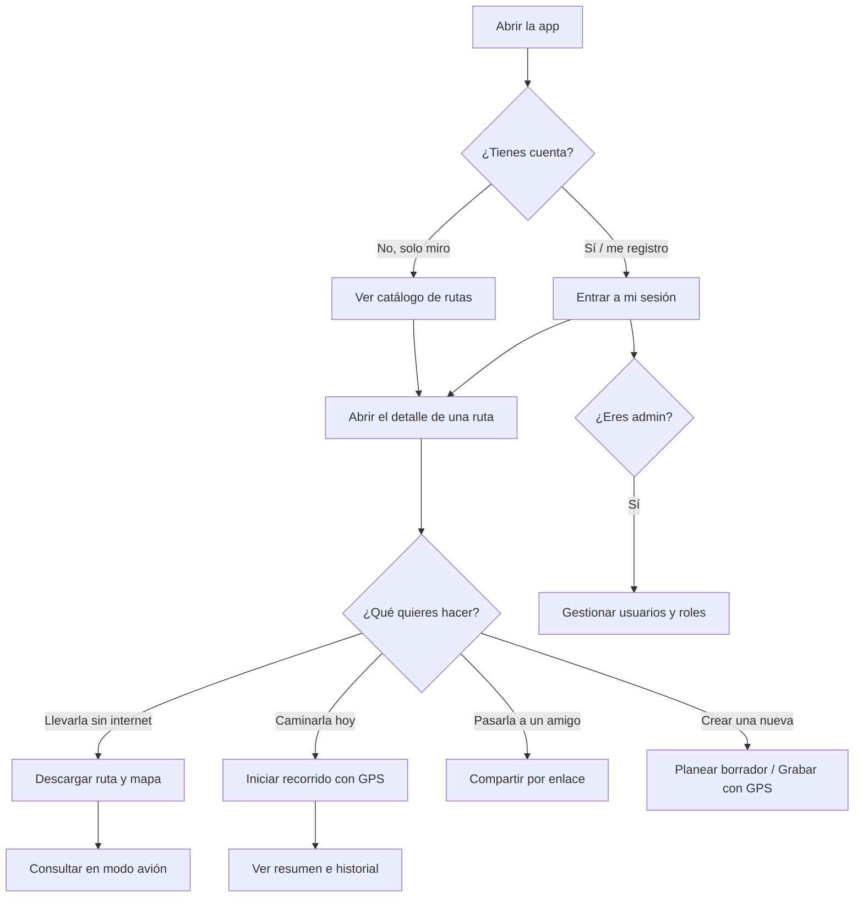
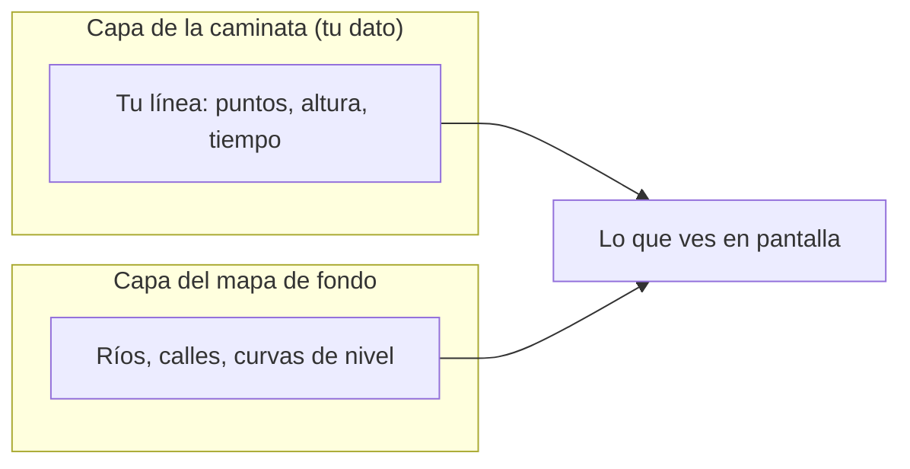
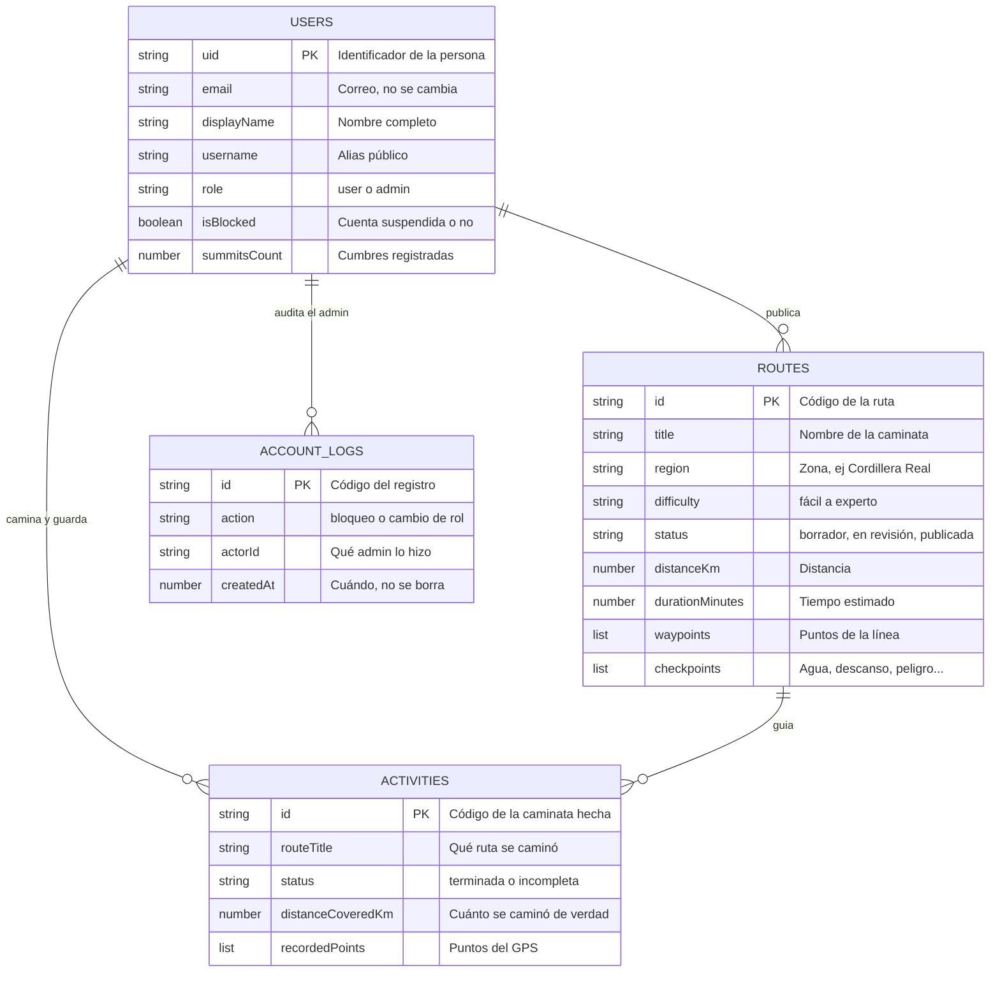
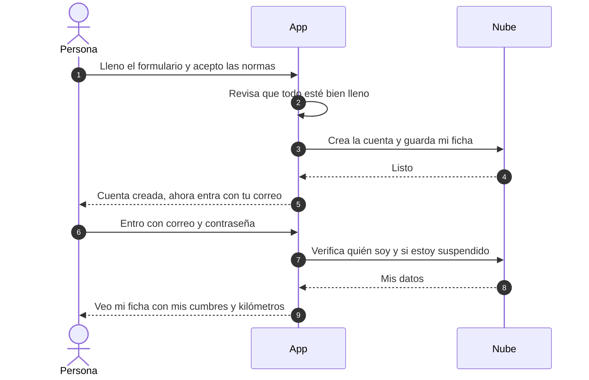
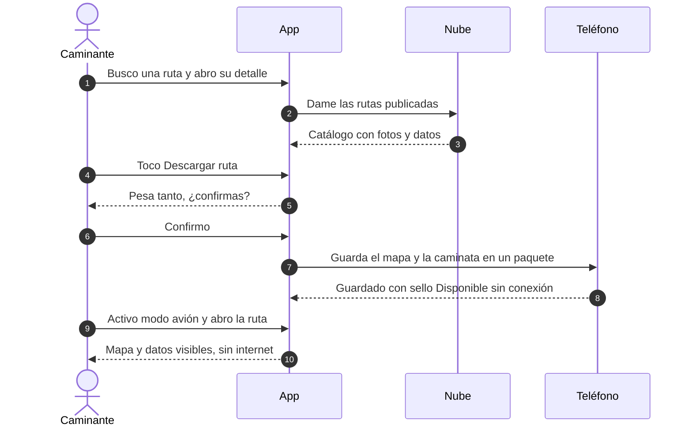
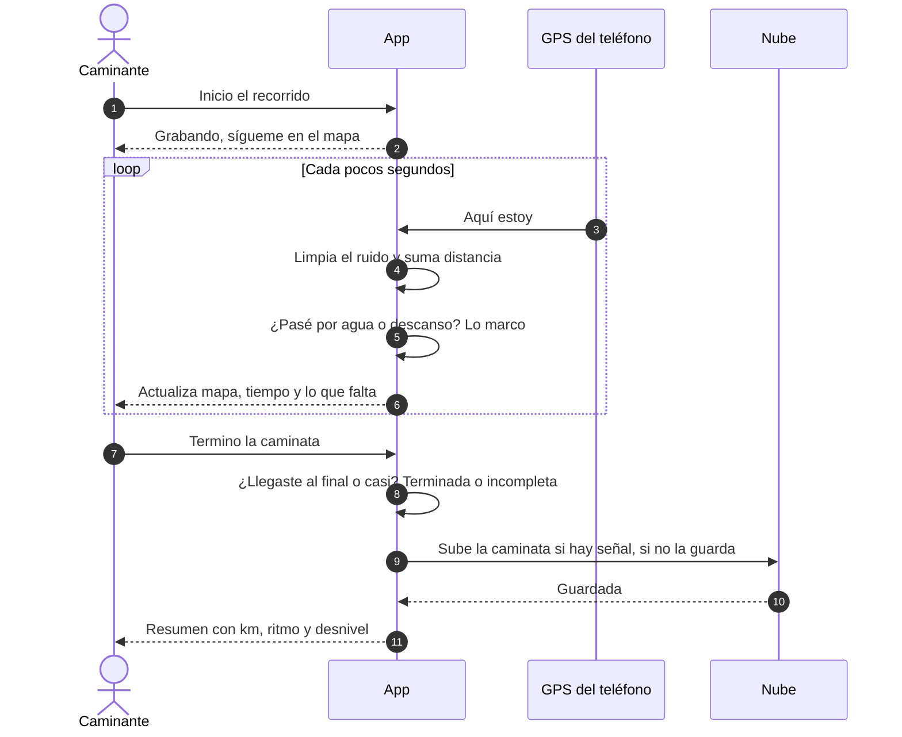
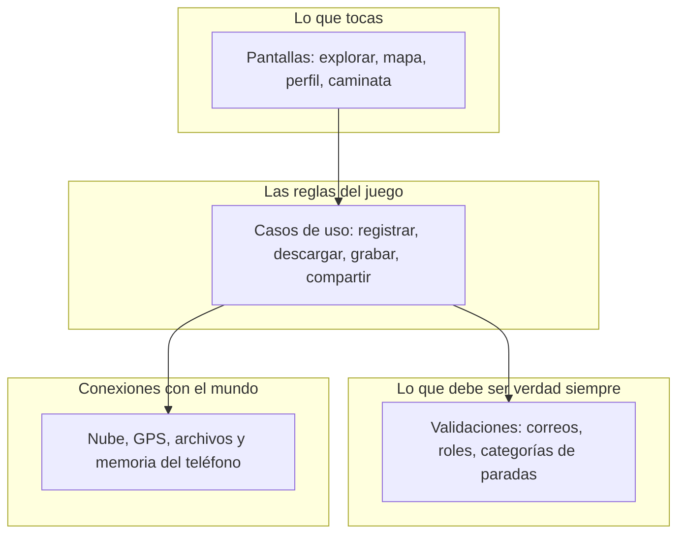
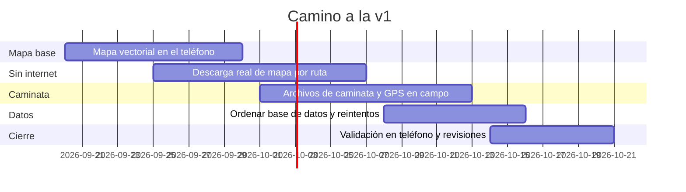

# TREKKIN APP — Informe para el cliente (v1 en camino)

> **Qué es este documento:** la explicación del proyecto en palabras comunes, sin tecnicismos. Dice qué hace la app hoy, qué falta para la versión 1 y cómo se va a comprobar. Todo lo que aquí se afirma se puede rastrear a una historia de usuario (`docs/USER_STORIES.md`) y a una tarea del backlog (`docs/BACKLOG.md`).
> Revisión 2026-09-15. Regla de la casa: **nada es 100% hasta probarlo en un teléfono real, con revisión de diseño y con el visto bueno del usuario**.

---

## 1. El problema y la solución, en simple

En la montaña boliviana (Cordillera Real, valles interandinos) **el celular se queda sin señal**. Las apps normales de mapas dejan de funcionar justo cuando más se las necesita. Además, no hay un lugar único donde estén las rutas verificadas: dónde hay agua, dónde acampar, cuánto se tarda, qué tan dura es la caminata.

**Trekkin App** es una app de celular pensada para eso:

1. **Ver rutas antes de salir:** catálogo abierto de caminatas con distancia, tiempo, dificultad y fotos. Sin necesidad de registrarse para mirar.
2. **Llevarse el mapa en el bolsillo:** descargar una ruta con su mapa para consultarla en modo avión, sin internet.
3. **Caminar con guía:** el teléfono marca tu posición sobre el recorrido, avisa al pasar por puntos clave (agua, descanso, peligro) y guarda tu caminata.
4. **Compartir y cuidar:** enviar rutas a compañeros por enlace y, para administradores, cuidar la comunidad (bloquear cuentas, dar roles).

---

## 2. Estado honesto: qué funciona hoy y qué falta para la v1

Semáforo: 🟢 funciona · 🟡 a medias · 🔴 pendiente.

| Historia | En palabras simples | Estado | Qué falta para la v1 (ver backlog) |
| :--- | :--- | :---: | :--- |
| HU-01 Crear cuenta | Registrarse con nombre, correo, alias y contraseña | 🟢 95% | Verificación de correo |
| HU-02 Entrar y perfil | Entrar, ver mi ficha, cambiar nombre/alias, salir | 🟢 90% | Cambio de contraseña y tema visual |
| HU-03 Ver rutas | Catálogo abierto, fotos de portada, ver detalle y mapa nativo | 🟢 90% | Pruebas en matriz física de teléfonos |
| HU-04 Llevar sin internet | Botón descargar ruta y cálculo real de MB | 🟡 55% | Descarga física de teselas a almacenamiento local |
| HU-05 Compartir | Enviar ruta por enlace y WhatsApp/Telegram | 🟢 85% | Adjuntar el archivo de la caminata al mensaje |
| HU-06 Caminar con guía | Seguir la ruta con GPS, pausar, terminar, ver historial | 🟡 65% | Que siga grabando con pantalla apagada, migrar vista a TrekMap |
| HU-07 Planear ruta | Marcar puntos, guardar borrador e importar GPX/KML | 🟢 85% | Edición fina de puntos en pantalla (deshacer/borrar) |
| HU-08 Grabar ruta nueva | Grabar caminata, paradas y exportar archivo GPX | 🟢 80% | Grabación con pantalla bloqueada |
| HU-09 Moderación | — | 🚫 Eliminada | Los admin revisan; no hay rol moderador |
| HU-10 Administrar | Ver usuarios, bloquear, cambiar roles, con registro de todo | 🟢 90% | Paginar listas largas |

**Lectura ejecutiva:** cuentas, catálogo, compartir y administración están sólidas. La v1 se juega en dos cosas: **el mapa de fondo sin internet** y **el GPS en campo**. Todo el plan de trabajo (BK-001 a BK-054) apunta ahí.

---

## 3. Cómo funciona para cada persona (interacciones)

Notas de trazabilidad: el visitante mira sin fricción (HU-03); las acciones de escritura piden entrar (HU-01/HU-02); el admin tiene su zona separada (HU-10).

---

## 4. El mapa tiene dos capas (idea clave de la v1)

Un error común: creer que el archivo de la caminata **es** el mapa. No. Son dos cosas:

* **Capa de la caminata:** archivo `.gpx` (el estándar abierto que entienden Garmin, Wikiloc y Google Earth). La app lo dibuja y también lo entiende en `.kml`, `.kmz`, `.tcx`, `.csv`, `.plt` cuando alguien lo trae de otro lado. Sin mapa de fondo, esta capa se ve como una línea sobre fondo gris: sirve, pero no orienta.
* **Capa del mapa de fondo:** mosaicos vectoriales abiertos (sin llaves de pago) que dibujan montañas, ríos y caminos con nitidez a cualquier zoom, y se guardan en **un solo paquete por ruta** para usar sin internet. Nada de miles de fotitos sueltas.

---

## 5. Qué guarda el sistema (simple)

En buen cristiano: personas, rutas, caminatas hechas y un cuaderno de auditoría que nadie puede borrar. Los detalles finos están en `docs/DATABASE.md`.

---

## 6. Cómo se hablan las partes (3 recorridos que importan)

### 6.1. Registrarse, entrar y ver mi ficha (HU-01 / HU-02)

### 6.2. Descargar una ruta y usarla en modo avión (HU-03 / HU-04)

### 6.3. Caminar con GPS y guardar la caminata (HU-06 / HU-08)

---

## 7. Por dentro: piezas y responsabilidades (resumen no técnico)

La idea que le sirve al cliente: **las reglas no dependen de la nube**. Si mañana se cambia de proveedor, las pantallas y las reglas siguen iguales; solo se cambia el conector. Detalle técnico en `docs/ARCHITECTURE.md`.

---

## 8. Cómo sabemos que funciona (validación real, no promesas)

1. **Pruebas automáticas: 126 que pasan** (`npm test` vía Docker). Cubren registro, sesión, compartir, borradores, descarga, máquina de estados del GPS y bitácora admin.
2. **Lo pendiente para decir 100%** (gates BK-050 a BK-054, obligatorios):
   * Probar en teléfono real con Expo Go **y** en versión instalada de desarrollo.
   * Probar en modo avión lo que dice funcionar sin internet.
   * Revisión de diseño sin bloqueos + revisión del código por una persona + visto bueno del usuario.
3. **Preguntas que siempre hacemos antes de programar:** ¿en qué historia estamos y quién la pide?, ¿cuáles son los criterios exactos?, ¿esto que me pides está dentro de lo acordado o es algo nuevo?

---

## 9. Camino a la v1 (resumen del backlog)

Detalle tarea por tarea en `docs/BACKLOG.md` (BK-001 a BK-054).

---

## 10. Guion de presentación (7 minutos, en tus palabras)

**Minuto 0:00–1:30 — El dolor real.**
*"Imaginen estar a 4.600 metros en el Huayna Potosí. El teléfono dice Sin Servicio y el mapa se queda en blanco. Eso le pasa hoy a quien camina en Bolivia. Trekkin nació para que el mapa, la ruta y tu posición sigan ahí aunque no haya internet."*

**Minuto 1:30–3:30 — Qué hace.**
*"Muestren el catálogo: cualquiera puede ver rutas, filtrar por dificultad y abrir el detalle con distancia, tiempo y puntos de agua. Luego la descarga: un toque y la ruta queda Disponible sin conexión. Después el GPS: te ve moverte, te marca las paradas y te guarda la caminata. Y todo se puede compartir por enlace."*

**Minuto 3:30–5:00 — Por qué es sólido.**
*"Dos decisiones: el mapa tiene dos capas —tu caminata y el fondo— y las reglas del negocio no dependen del proveedor de nube. Si algo se cae, el teléfono guarda y sincroniza después. Cuentas con roles, bitácora que no se borra y validaciones en cada dato que entra."*

**Minuto 5:00–6:30 — Cómo lo comprobamos.**
*"126 pruebas automáticas que pasan, y una regla dura: nada es 100% sin probarlo en teléfono real, en modo avión cuando aplique, con revisión de diseño y de código, y con su visto bueno."*

**Minuto 6:30–7:00 — Cierre.**
*"Cuentas, catálogo, compartir y administración ya caminan. La v1 se completa con el mapa sin internet y el GPS en campo, con plan y fechas en mano. Pasemos a la demo en el teléfono. Gracias."*

---

## 11. Mini glosario (por si alguien pregunta)

* **Modo avión / sin conexión:** usar la app sin internet, con lo ya descargado.
* **Borrador:** ruta en preparación, solo la ve su autor.
* **Publicada:** ruta revisada y visible para todos.
* **Paquete sin internet:** el mapa de fondo + la caminata guardados juntos en el teléfono.
* **Archivo .gpx:** el formato abierto de caminatas que entienden Garmin, Wikiloc y Google Earth.
* **Bitácora:** cuaderno de auditoría donde queda quién bloqueó o cambió roles, sin borrado.
