# TREKKIN APP — Informe para el cliente (v1 en camino)

> **Qué es este documento:** la explicación del proyecto en palabras comunes, sin tecnicismos excesivos. Dice qué hace la app hoy, con qué código y entregables se sostiene, qué falta para la versión 1 y cómo se va a comprobar. Todo lo que aquí se afirma se puede rastrear a una historia de usuario (`docs/USER_STORIES.md`), a una tarea del backlog (`docs/BACKLOG.md`) o a un artefacto del repositorio.
> Revisión **2026-09-24**. Fuentes de avance: `docs/USER_STORIES.md` (figura oficial del equipo, rev. 2026-09-17). El informe académico `docs/Informe_Academico_UNANDES_Trekking.docx` aporta estructura UML/maquetas, **no** manda en porcentajes ni en hechos técnicos (ver §12).
> Regla de la casa: **nada es 100% hasta probarlo en un teléfono real, con revisión de diseño y con el visto bueno del usuario**.

---

## 1. El problema y la solución, en simple

En la montaña boliviana (Cordillera Real, valles interandinos) **el celular se queda sin señal**. Las apps normales de mapas dejan de funcionar justo cuando más se las necesita. Además, no hay un lugar único donde estén las rutas verificadas: dónde hay agua, dónde acampar, cuánto se tarda, qué tan dura es la caminata.

**Trekkin App** es una app de celular pensada para eso:

1. **Ver rutas antes de salir:** catálogo abierto de caminatas con distancia, tiempo, dificultad y fotos. Sin necesidad de registrarse para mirar.
2. **Llevarse el mapa en el bolsillo:** descargar una ruta con su mapa para consultarla en modo avión, sin internet.
3. **Caminar con guía:** el teléfono marca tu posición sobre el recorrido, avisa al pasar por puntos clave (agua, descanso, peligro) y guarda tu caminata.
4. **Compartir y cuidar:** enviar rutas a compañeros por enlace y, para administradores, cuidar la comunidad (bloquear cuentas, dar roles).

---

## 2. Estado honesto: qué funciona hoy y qué falta para la v1

Semáforo: 🟢 funciona · 🟡 a medias · 🔴 pendiente.
**Fuente de %:** `docs/USER_STORIES.md` (revisión técnica 2026-09-17). Si un número de otro documento difiere, manda este.

| Historia                  | En palabras simples                                                                                 |    Estado    | Qué falta para la v1 (ver backlog)                                                                  |
| :------------------------ | :-------------------------------------------------------------------------------------------------- | :----------: | :-------------------------------------------------------------------------------------------------- |
| HU-01 Crear cuenta        | Registrarse con nombre, correo, alias y contraseña                                                  |    🟢 95%    | Verificación de correo; matriz dev-build                                                            |
| HU-02 Entrar y perfil     | Entrar, ver mi ficha, cambiar nombre/alias, salir                                                   |    🟢 90%    | Cambio de contraseña y tema visual (BK-042 parcial)                                                 |
| HU-03 Ver rutas           | Catálogo abierto, fotos de portada, detalle con mapa MapLibre (OSM/OpenFreeMap, sin Google de pago) |    🟢 90%    | Probar en Expo Go Android y en `http://localhost:8081`                                              |
| HU-04 Llevar sin internet | Botón descargar ruta y cálculo real de MB                                                           |    🟡 80%    | `packSpec` en Firestore (BK-012); progreso/cuota (BK-014); evidencia PMTiles en frío en dispositivo |
| HU-05 Compartir           | Enviar ruta por enlace y WhatsApp/Telegram                                                          |    🟢 80%    | Adjuntar el archivo GPX al share sheet nativo                                                       |
| HU-06 Caminar con guía    | Seguir la ruta con GPS, pausar, terminar, ver historial                                             |    🟡 75%    | Grabación con pantalla apagada en equipo; tracking 100% sobre `TrekMap` (BK-023)                    |
| HU-07 Planear ruta        | Marcar puntos, guardar borrador e importar GPX/KML                                                  |    🟢 85%    | Edición fina de puntos en pantalla (undo/clear/drag — BK-041)                                       |
| HU-08 Grabar ruta nueva   | Grabar caminata, paradas y exportar archivo GPX                                                     |    🟢 85%    | Evidencia con pantalla bloqueada / app terminada / endurance                                        |
| HU-09 Moderación          | —                                                                                                   | 🚫 Eliminada | Los admin revisan; no hay rol moderador                                                             |
| HU-10 Administrar         | Ver usuarios, bloquear, cambiar roles, con registro de todo                                         |    🟢 90%    | Paginación por cursor ya implementada en código; falta prueba Expo Go con >50 usuarios              |

**Lectura ejecutiva:** cuentas, catálogo, compartir y administración están sólidas. La v1 se juega en **el mapa de fondo sin internet** y **el GPS en campo**. Trazabilidad: BK-001 a BK-053 en `docs/BACKLOG.md`.

---

## 3. Cómo funciona para cada persona (interacciones)

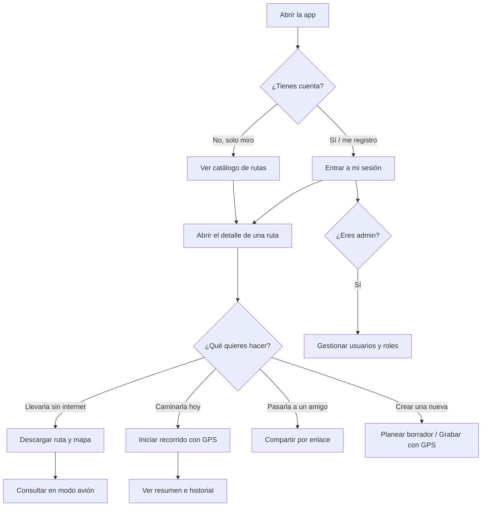
```mermaid
flowchart TD
    A["Abrir la app"] --> B{"¿Tienes cuenta?"}
    B -- "No, solo miro" --> C["Ver catálogo de rutas"]
    B -- "Sí / me registro" --> D["Entrar a mi sesión"]
    C --> E["Abrir el detalle de una ruta"]
    D --> E
    E --> F{"¿Qué quieres hacer?"}
    F -- "Llevarla sin internet" --> G["Descargar ruta y mapa"]
    F -- "Caminarla hoy" --> H["Iniciar recorrido con GPS"]
    F -- "Pasarla a un amigo" --> I["Compartir por enlace"]
    F -- "Crear una nueva" --> J["Planear borrador / Grabar con GPS"]
    G --> K["Consultar en modo avión"]
    H --> L["Ver resumen e historial"]
    D --> M{"¿Eres admin?"}
    M -- "Sí" --> N["Gestionar usuarios y roles"]
```

Notas de trazabilidad: el visitante mira sin fricción (HU-03); las acciones de escritura piden entrar (HU-01/HU-02); el admin tiene su zona separada (HU-10).

---

## 4. El mapa tiene dos capas (idea clave de la v1)

Un error común: creer que el archivo de la caminata **es** el mapa. No. Son dos cosas:

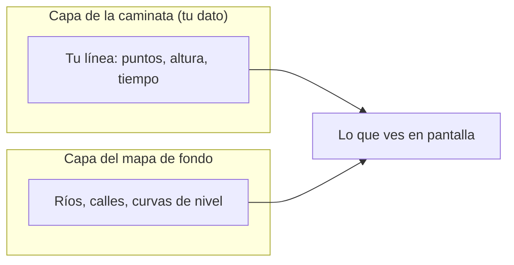
```mermaid
flowchart LR
    subgraph ARRIBA["Capa de la caminata (tu dato)"]
        U["Tu línea: puntos, altura, tiempo"]
    end
    subgraph ABAJO["Capa del mapa de fondo"]
        M["Ríos, calles, curvas de nivel"]
    end
    U --> O["Lo que ves en pantalla"]
    M --> O
```

- **Capa de la caminata:** archivo `.gpx` (el estándar abierto que entienden Garmin, Wikiloc y Google Earth). La app lo dibuja y también lo entiende en `.kml`, `.csv` al importar. Sin mapa de fondo, esta capa se ve como una línea sobre fondo gris: sirve, pero no orienta.
- **Capa del mapa de fondo:** mosaicos vectoriales abiertos (sin llaves de pago) que dibujan montañas, ríos y caminos con nitidez a cualquier zoom, y se guardan en **un solo paquete por ruta** (PMTiles) para usar sin internet. Nada de miles de fotitos sueltas.
- **Puntos GPS largos no van a la nube por piezas:** se guardan en el teléfono (SQLite/AsyncStorage); en la nube solo van metadatos y, al finalizar, el archivo GPX. No existe subcolección `points/chunk` en Firestore (anti-colapso de documentos de 1 MB).

---

## 5. Qué guarda el sistema (simple)

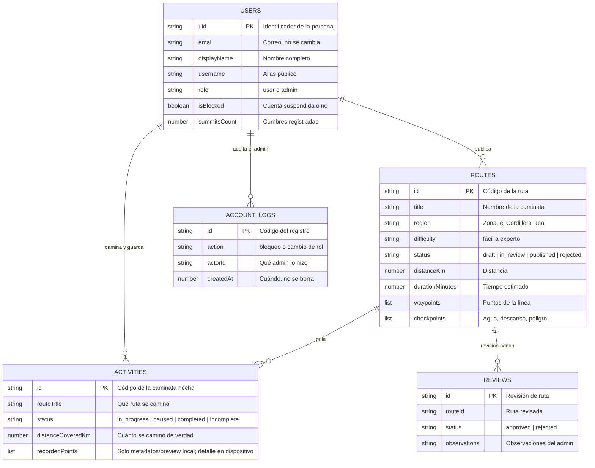
```mermaid
erDiagram
    USERS ||--o{ ROUTES : "publica"
    USERS ||--o{ ACTIVITIES : "camina y guarda"
    ROUTES ||--o{ ACTIVITIES : "guia"
    USERS ||--o{ ACCOUNT_LOGS : "audita el admin"
    ROUTES ||--o{ REVIEWS : "revision admin"

    USERS {
        string uid PK "Identificador de la persona"
        string email "Correo, no se cambia"
        string displayName "Nombre completo"
        string username "Alias público"
        string role "user o admin"
        boolean isBlocked "Cuenta suspendida o no"
        number summitsCount "Cumbres registradas"
    }

    ROUTES {
        string id PK "Código de la ruta"
        string title "Nombre de la caminata"
        string region "Zona, ej Cordillera Real"
        string difficulty "fácil a experto"
        string status "draft | in_review | published | rejected"
        number distanceKm "Distancia"
        number durationMinutes "Tiempo estimado"
        list waypoints "Puntos de la línea"
        list checkpoints "Agua, descanso, peligro..."
    }

    ACTIVITIES {
        string id PK "Código de la caminata hecha"
        string routeTitle "Qué ruta se caminó"
        string status "in_progress | paused | completed | incomplete"
        number distanceCoveredKm "Cuánto se caminó de verdad"
        list recordedPoints "Solo metadatos/preview local; detalle en dispositivo"
    }

    REVIEWS {
        string id PK "Revisión de ruta"
        string routeId "Ruta revisada"
        string status "approved | rejected"
        string observations "Observaciones del admin"
    }

    ACCOUNT_LOGS {
        string id PK "Código del registro"
        string action "bloqueo o cambio de rol"
        string actorId "Qué admin lo hizo"
        number createdAt "Cuándo, no se borra"
    }
```

En buen cristiano: personas, rutas, caminatas hechas, revisiones de publicación y un cuaderno de auditoría que nadie puede borrar. Los detalles finos están en `docs/DATABASE.md`.

---

## 6. Cómo se hablan las partes (3 recorridos que importan)

### 6.1. Registrarse, entrar y ver mi ficha (HU-01 / HU-02)

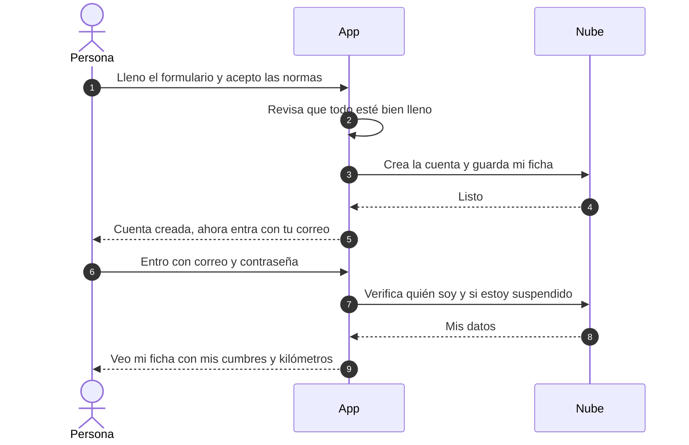
```mermaid
sequenceDiagram
    autonumber
    actor P as Persona
    participant A as App
    participant N as Nube

    P->>A: Lleno el formulario y acepto las normas
    A->>A: Revisa que todo esté bien lleno
    A->>N: Crea la cuenta y guarda mi ficha
    N-->>A: Listo
    A-->>P: Cuenta creada, ahora entra con tu correo
    P->>A: Entro con correo y contraseña
    A->>N: Verifica quién soy y si estoy suspendido
    N-->>A: Mis datos
    A-->>P: Veo mi ficha con mis cumbres y kilómetros
```

### 6.2. Descargar una ruta y usarla en modo avión (HU-03 / HU-04)

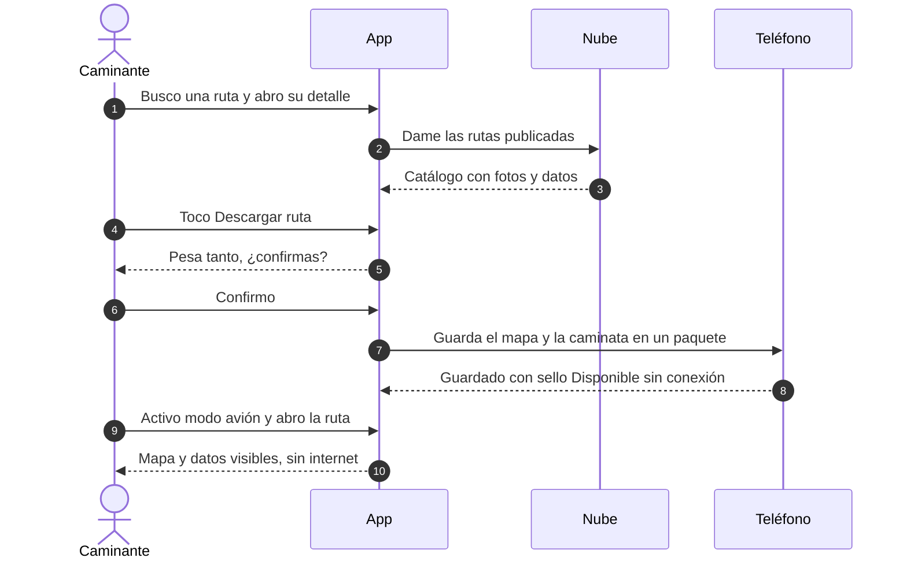
```mermaid
sequenceDiagram
    autonumber
    actor C as Caminante
    participant A as App
    participant N as Nube
    participant T as Teléfono

    C->>A: Busco una ruta y abro su detalle
    A->>N: Dame las rutas publicadas
    N-->>A: Catálogo con fotos y datos
    C->>A: Toco Descargar ruta
    A-->>C: Pesa tanto, ¿confirmas?
    C->>A: Confirmo
    A->>T: Guarda el mapa y la caminata en un paquete
    T-->>A: Guardado con sello Disponible sin conexión
    C->>A: Activo modo avión y abro la ruta
    A-->>C: Mapa y datos visibles, sin internet
```

### 6.3. Caminar con GPS y guardar la caminata (HU-06 / HU-08)

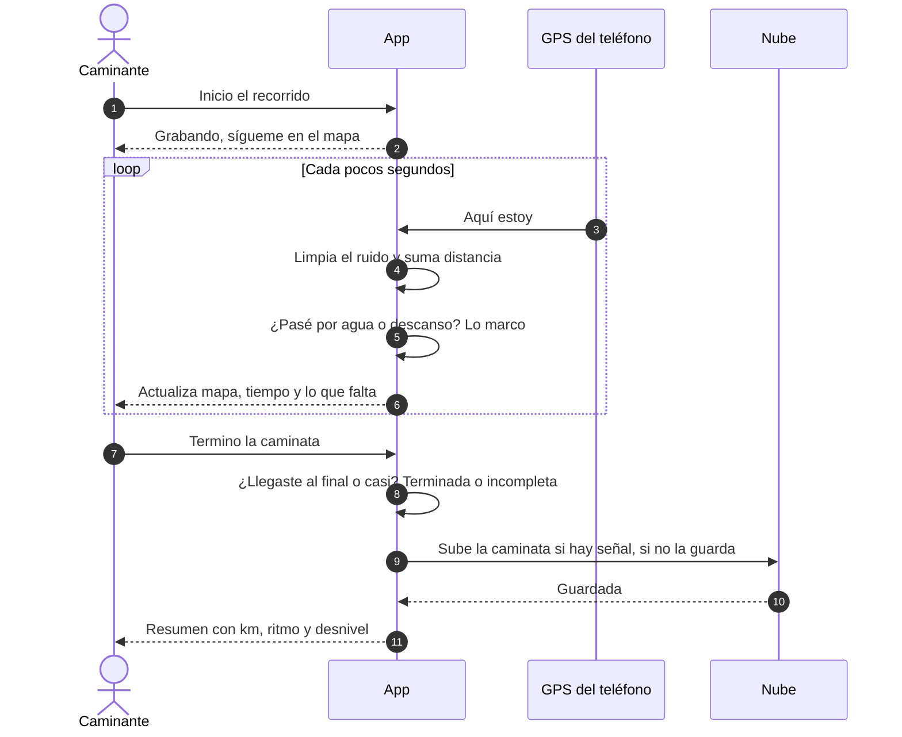
```mermaid
sequenceDiagram
    autonumber
    actor C as Caminante
    participant A as App
    participant G as GPS del teléfono
    participant N as Nube

    C->>A: Inicio el recorrido
    A-->>C: Grabando, sígueme en el mapa
    loop Cada pocos segundos
        G->>A: Aquí estoy
        A->>A: Limpia el ruido y suma distancia
        A->>A: ¿Pasé por agua o descanso? Lo marco
        A-->>C: Actualiza mapa, tiempo y lo que falta
    end
    C->>A: Termino la caminata
    A->>A: ¿Llegaste al final o casi? Terminada o incompleta
    A->>N: Sube la caminata si hay señal, si no la guarda
    N-->>A: Guardada
    A-->>C: Resumen con km, ritmo y desnivel
```

---

## 7. Por dentro: piezas y responsabilidades

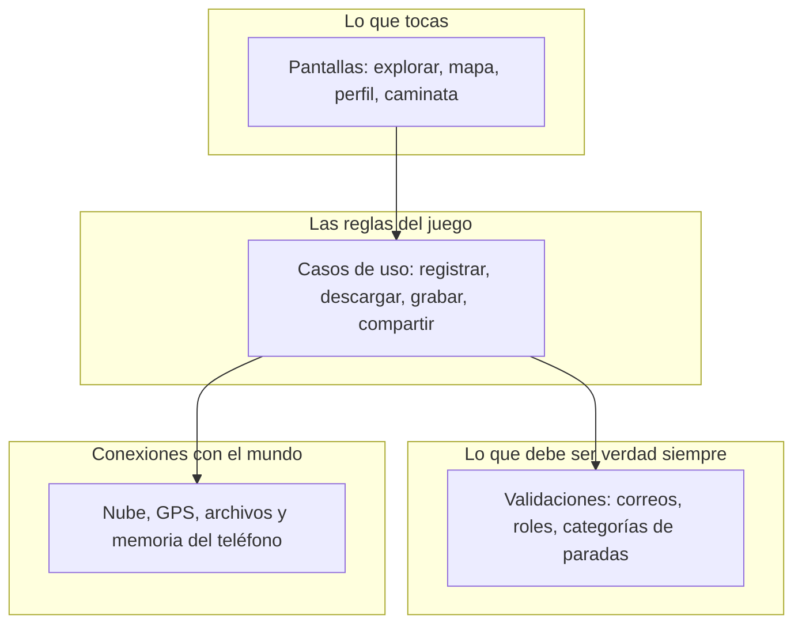
```mermaid
flowchart TD
    subgraph PANTALLAS["Lo que tocas"]
        V["Pantallas: explorar, mapa, perfil, caminata"]
    end
    subgraph REGLAS["Las reglas del juego"]
        R["Casos de uso: registrar, descargar, grabar, compartir"]
    end
    subgraph DATOSR["Lo que debe ser verdad siempre"]
        D["Validaciones: correos, roles, categorías de paradas"]
    end
    subgraph CONEX["Conexiones con el mundo"]
        F["Nube, GPS, archivos y memoria del teléfono"]
    end
    V --> R
    R --> D
    R --> F
```

La idea que le sirve al cliente: **las reglas no dependen de la nube**. Si mañana se cambia de proveedor, las pantallas y las reglas siguen iguales; solo se cambia el conector. Detalle técnico en `docs/ARCHITECTURE.md` y `CLEAN_ARCH_RULES.md`.

---

## 8. Fundamentos con código (capas reales del repo)

Cada capa solo conoce a la de abajo mediante contratos (interfaces TypeScript, esquemas Zod, `firestore.rules`). **Ninguna flecha sale hacia afuera desde el dominio.**

| Capa lógica           | Paquetes reales                                                                                                                                                          | Responsabilidad                                                                                                                              |
| :-------------------- | :----------------------------------------------------------------------------------------------------------------------------------------------------------------------- | :------------------------------------------------------------------------------------------------------------------------------------------- |
| **Núcleo de dominio** | `src/core/domain/` — `types.ts`, `*.schemas.ts` (Zod), `trackFormats.ts`, `geoBounds.ts`, `calculations.ts`, `mapPackFormats.ts`, `offline.ts`, `plan.ts`, `activity.ts` | La verdad del sistema: entidades, validación, cálculos geográficos y formatos GPX/KML/CSV. **TypeScript puro** (sin RN/Expo/Firebase).       |
| **Casos de uso**      | `src/core/application/{auth,explore,offline,share,activity,plan,route,admin}/` — **46** `*.usecase.ts`                                                                   | Las reglas del juego con **puertos inyectados**: registrar, explorar, descargar, compartir, caminar, planificar, grabar, administrar. Puros. |
| **Nube y sesión**     | `src/infrastructure/firebase/config.ts`, `auth/AuthContext.tsx`, `database/*`, `persistence/storage.ts`                                                                  | Firebase Auth + Firestore + AsyncStorage (clave `trekkin_auth_user`); RBAC `user`/`admin` y bloqueo.                                         |
| **Mapa y GPS**        | `src/infrastructure/map/mapStyle.ts`, `mapBridge.ts`, `location/locationService.ts`, `persistence/tileCacheDB.ts` + `TrekMap`                                            | MapLibre GL (OpenFreeMap/OSM), `expo-location`, packs PMTiles locales.                                                                       |
| **Presentación**      | `src/presentation/views/*`, `components/{ui,map,plan}`, `theme.ts` + `App.tsx` (Gate)                                                                                    | Vistas delgadas (~150 líneas), primitivas `Button`/`Field`/`Banner`, tokens solo desde `AndeanTheme`. Sin `firebase/*` directo.              |
| **Verificación**      | `src/tests/*.test.ts` — **27** archivos de suite                                                                                                                         | Contrato ejecutable por HU (auth, mapa, offline, share, plan, activity, admin, formatos).                                                    |

### 8.1 Contratos entre capas (cruces que importan)

| Frontera        | Contrato                                            | Ejemplo verificable                                                                                                           |
| :-------------- | :-------------------------------------------------- | :---------------------------------------------------------------------------------------------------------------------------- |
| UI → Negocio    | Puertos de casos de uso + Zod en dominio            | `RegisterForm` → `RegisterSchema` → `RegisterUserUseCase(ports)`; error tipado, nunca excepción cruda                         |
| Negocio → Datos | Interfaces de repositorio + reglas Firestore        | `ListPublishedRoutesPaginated` → `routeService.listPublishedRoutesPaginated(limit + startAfter)`                              |
| Geografía       | Firmas puras sin I/O                                | `parseGPX` → track; `buildGPX11` → XML 1.1; `toGeoJSON` → FeatureCollection `[lng,lat]`; `estimateDownloadSizeMB` → MB reales |
| App ↔ exterior  | Deep link + share + formatos abiertos               | `trekkin-app://r/{routeId}`; GPX 1.1 interoperable; PMTiles V1 offline                                                        |
| Sesión          | `AuthContext` + `onAuthStateChanged` + AsyncStorage | Login → Gate re-render; `signOut` purga `trekkin_auth_user`; `isNetworkError` distingue red de credencial inválida            |
| Gobierno        | RBAC + `accountLogs` inmutable                      | `hasRole(['admin'])`; bloqueo/cambio de rol escriben `{actorId, acción, antes/después}`; anti-autobloqueo                     |

### 8.2 Diagrama de capas (mirar hacia adentro)

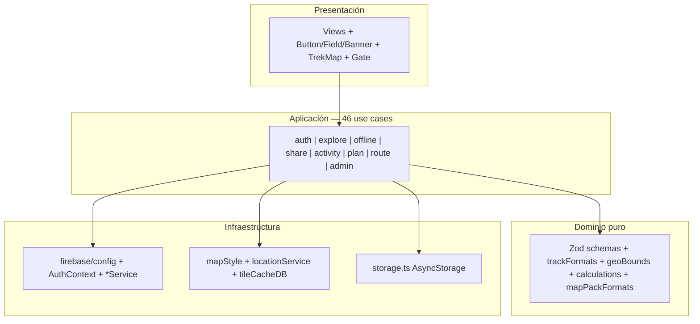
```mermaid
flowchart TB
    subgraph PRES["Presentación"]
        V["Views + Button/Field/Banner + TrekMap + Gate"]
    end
    subgraph APP["Aplicación — 46 use cases"]
        UC["auth | explore | offline | share | activity | plan | route | admin"]
    end
    subgraph DOM["Dominio puro"]
        Z["Zod schemas + trackFormats + geoBounds + calculations + mapPackFormats"]
    end
    subgraph INF["Infraestructura"]
        FB["firebase/config + AuthContext + *Service"]
        MP["mapStyle + locationService + tileCacheDB"]
        ST["storage.ts AsyncStorage"]
    end
    V --> UC
    UC --> Z
    UC --> FB
    UC --> MP
    UC --> ST
```

---

## 9. Entregables en el repositorio (inventario)

### 9.1 Subsistemas funcionales

| Entregable                         | Dónde vive                                                                                                                          | HU     |
| :--------------------------------- | :---------------------------------------------------------------------------------------------------------------------------------- | :----- |
| Auth + perfil + RBAC               | `RegisterUser` / `LoginUser` / `LogoutUser` / `UpdateUserProfile`, `AuthContext`, `userProfileService`                              | 01, 02 |
| Catálogo + detalle + preview       | `ListPublishedRoutes*`, `SearchRoutes`, `GetRouteDetail*`, `PublishRoute`, `routePreview.ts`, cache `routeDetailCache`              | 03     |
| Descarga offline GPX+PMTiles       | `DownloadRouteOffline`, `EstimateRouteDownloadSize`, `ResolveOfflinePack`, `tileCacheDB` (manifiesto v2), `mapPackFormats`          | 04     |
| Compartir + deep link + export GPX | `ShareRoute`, `CopyShareLink`, `PublishShareLink`, `ExportTrackFile`, `shareService`                                                | 05, 08 |
| Planificación borradores           | `SaveDraft`, `GetDraft`, `UpdatePlan`, `ImportTrackFile`, `ConfirmStartPoint`, `MarkReadyForGps`                                    | 07     |
| Actividad GPS + máquina de estados | `StartActivity` / `StartFreeRecording` / `RecordPoint` / `Pause` / `Resume` / `Finish`, `activityTrackDb` (SQLite), task background | 06, 08 |
| Admin usuarios + bitácora          | `ListUsers` (cursor), `BlockUser` / `UnblockUser`, `AssignRole`, `accountLogService`                                                | 10     |
| Mapa único                         | `TrekMap` (`TrekMap.web.tsx` / `TrekMap.native.tsx`), estilo OpenFreeMap, `offlinePackPath`                                         | 03–08  |
| Seguridad datos                    | `firestore.rules` (users/routes/activities/reviews/accountLogs), regla triple types ↔ rules ↔ `DATABASE.md`                         | todas  |

### 9.2 Backlog: hecho vs pendiente (resumen `docs/BACKLOG.md`)

- **Hecho ✅:** BK-002, BK-003, BK-004, BK-010, BK-011, BK-013, BK-020, BK-021, BK-022, BK-030, BK-031, BK-033, BK-040, BK-043, BK-044 (+ paginación HU-10 ya en código).
- **En curso 🟡:** BK-012 (`packSpec`), BK-023 (tracking TrekMap), BK-051/BK-052 (matriz de dispositivo y reviews).
- **Pendiente ⏳:** BK-014 (progreso/cuota), BK-032 (reintento unsynced), BK-041 (undo/clear/drag), BK-042 password/theme, gates de cierre BK-050…053.

### 9.3 Verificación automatizada

- **27** archivos de suite en `src/tests/` (auth, catálogo, preview, offline, share, plan, formatos, activity, admin, storage rules, background…).
- Comandos canónicos: `npm run lint` (0 errores `tsc`), `npm test`, `npx expo-doctor` si cambian nativos/permisos.
- La cifra histórica documentada de **126 casos** de aceptación figura en `USER_STORIES.md`; no se redeclara 100% sin matriz de dispositivo.

---

## 10. Diagramas UML y evidencia visual

Los mermaid de §3–§8 sirven para el flujo del cliente. Para revisión formal se adjuntan **casos de uso / comunicación** y **capturas reales** de la app (extraídas del informe académico; la app en pantalla es la del repo, no un mock).

### 10.1 Casos de uso, secuencia y comunicación

Inventario completo (17 figuras UML extraídas del docx académico): ver `docs/informe-formal/03-sprints.md` — sección Diseño por sprint.

**Visión general:**

**Casos de uso CU-01 … CU-09 (9 diagramas):**

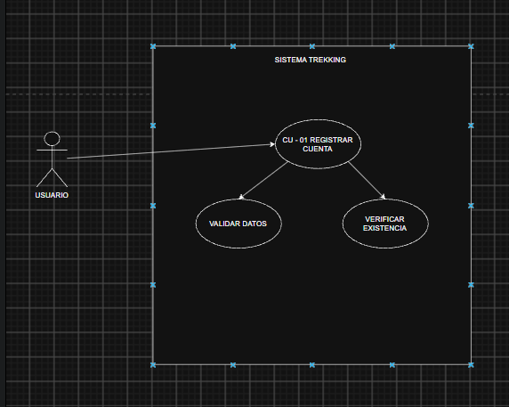
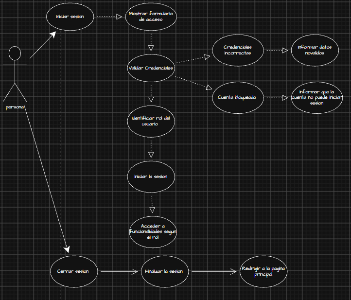
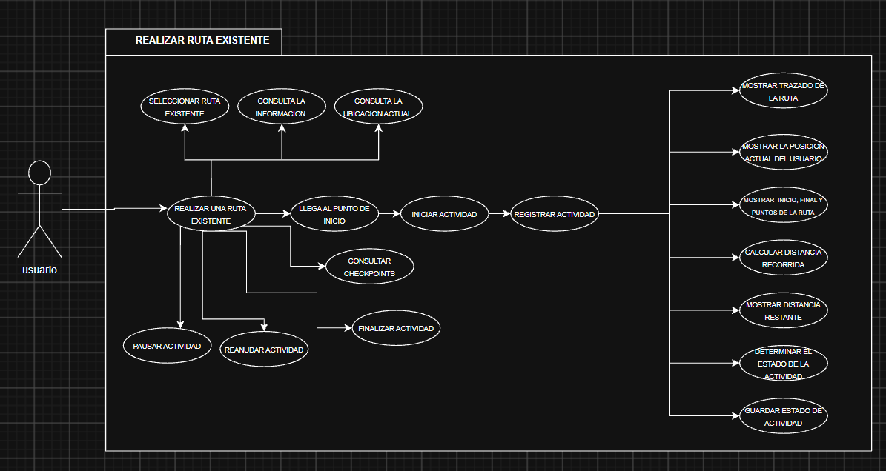

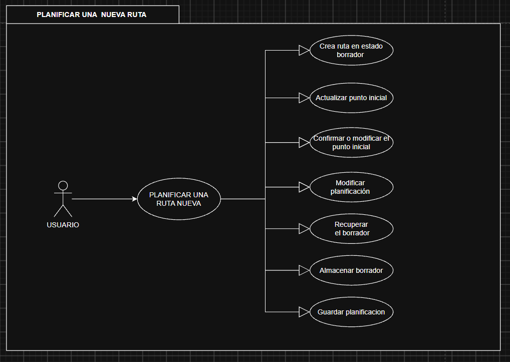
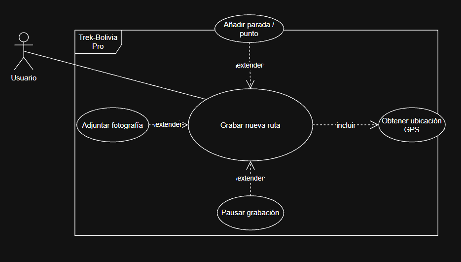
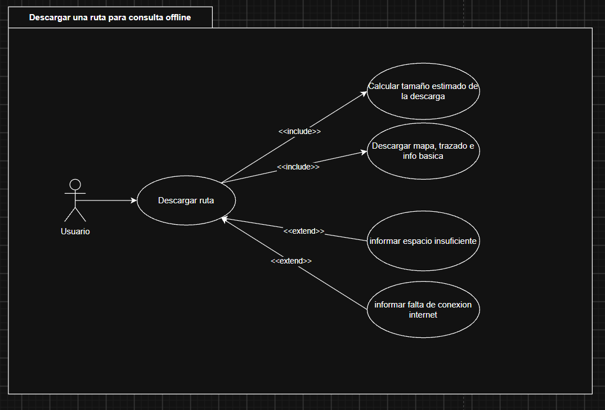

**Secuencia y comunicación (muestra):**

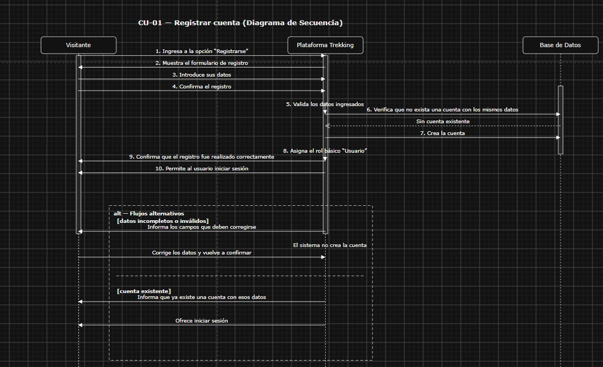
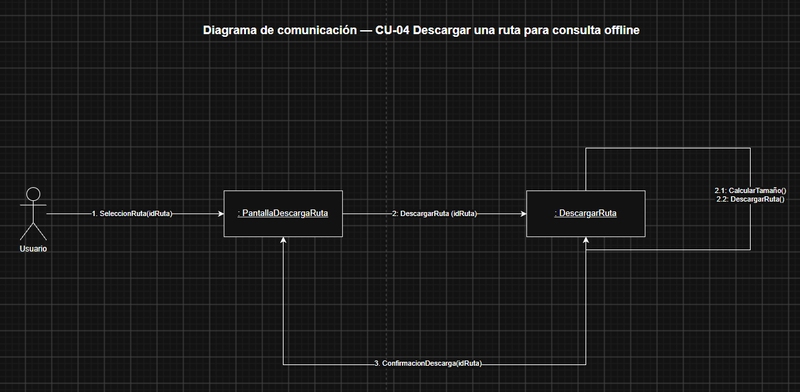

### 10.2 Capturas de la aplicación

**Catálogo HU-03:**

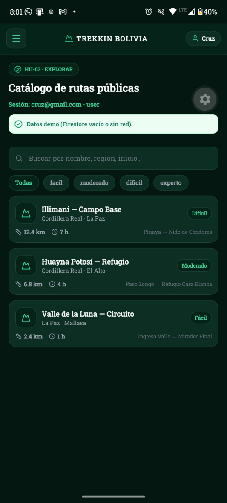

**Detalle con mapa y métricas:**

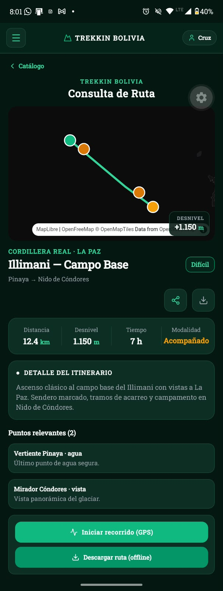

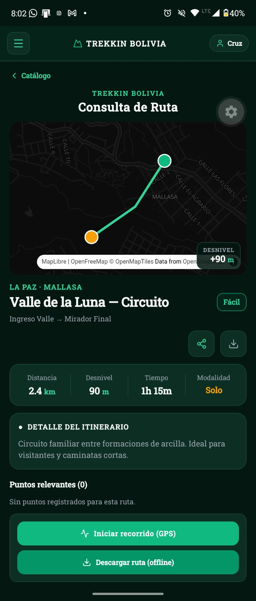

**Grabación GPS (pausa / finalizar):**

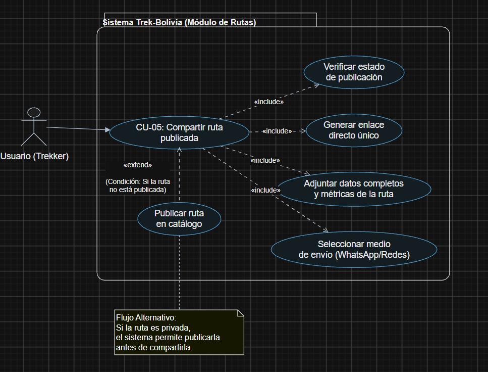

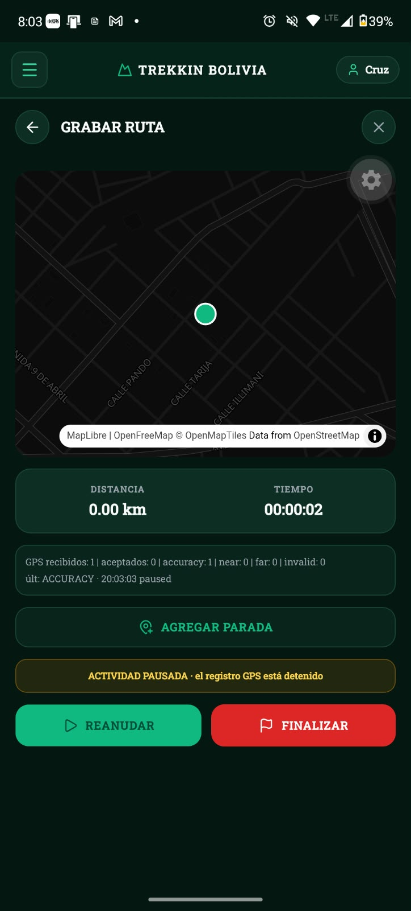

**Resultado y planificación:**

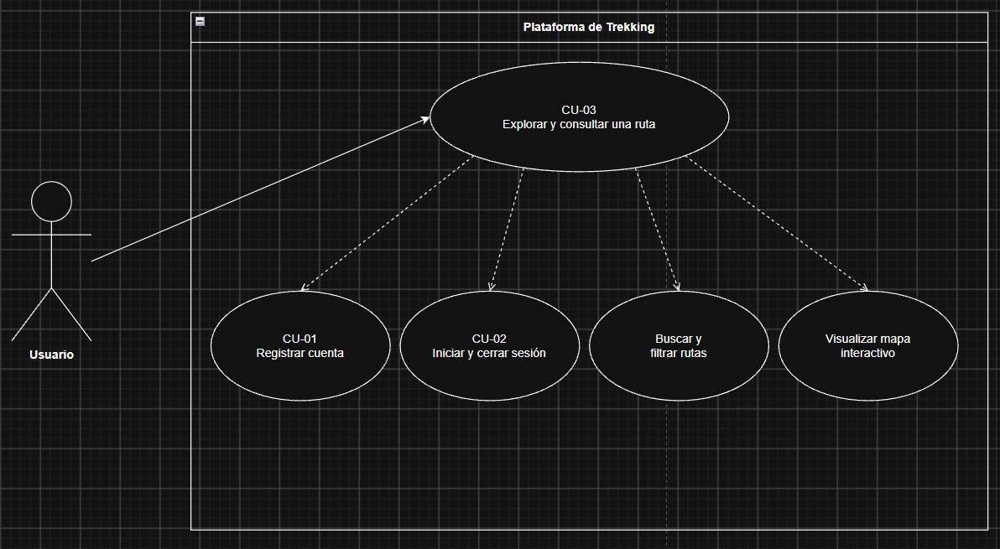

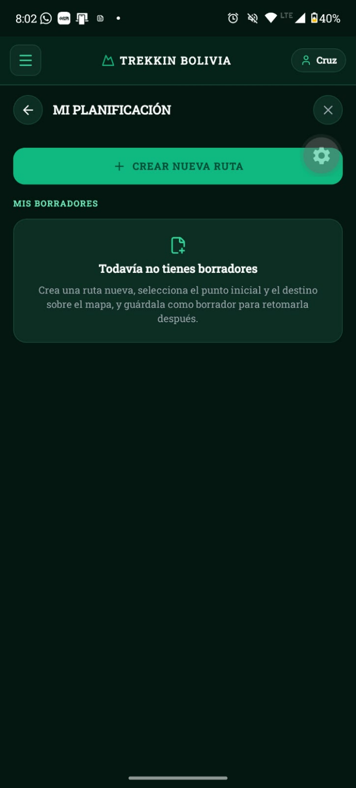

---

## 11. Cómo sabemos que funciona (validación real, no promesas)

1. **Pruebas automáticas en verde** (`npm test`) cubren registro, sesión, catálogo, descarga, compartir, borradores, máquina de estados del GPS, formatos y bitácora admin. Inventario: 27 suites en `src/tests/`.
2. **Lo pendiente para decir 100%** (gates BK-050 a BK-054, obligatorios):
   - Probar en teléfono real con Expo Go **y** en versión instalada de desarrollo.
   - Probar en modo avión lo que dice funcionar sin internet.
   - Firebase Emulator para reglas/Storage/sincronización.
   - Revisión de diseño sin bloqueos + revisión del código por una persona + visto bueno del usuario.
3. **Preguntas que siempre hacemos antes de programar:** ¿en qué historia estamos y quién la pide?, ¿cuáles son los criterios exactos?, ¿esto que me pides está dentro de lo acordado o es algo nuevo?

---

## 12. Qué manda ante documentos en conflicto

| Tema                             | Fuente que manda                                               | Por qué                                                                                                                                    |
| :------------------------------- | :------------------------------------------------------------- | :----------------------------------------------------------------------------------------------------------------------------------------- |
| **% de avance por HU**           | `docs/USER_STORIES.md`                                         | Figura oficial del equipo, revisada con el código                                                                                          |
| **Qué falta / orden de trabajo** | `docs/BACKLOG.md`                                              | Tareas BK con estado                                                                                                                       |
| **Hechos de arquitectura/datos** | Código + `ARCHITECTURE.md` + `DATABASE.md` + `firestore.rules` | El repo es la verdad ejecutable                                                                                                            |
| **Informe académico docx**       | Solo estructura UML, marco ISO/UML y capturas                  | Puede contener % viejos o claims no implementados (p. ej. subcolección `points/chunk` o rol moderador **no existen** en el código vigente) |

---

## 13. Camino a la v1 (resumen del backlog)

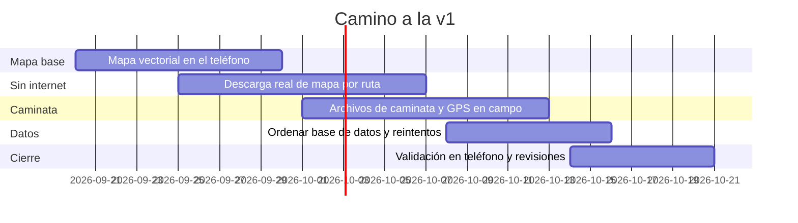
```mermaid
gantt
    title Camino a la v1
    dateFormat YYYY-MM-DD
    section Mapa base
    Mapa vectorial en el teléfono :a1, 2026-09-20, 10d
    section Sin internet
    Descarga real de mapa por ruta :a2, 2026-09-25, 12d
    section Caminata
    Archivos de caminata y GPS en campo :a3, 2026-10-01, 12d
    section Datos
    Ordenar base de datos y reintentos :a4, 2026-10-08, 8d
    section Cierre
    Validación en teléfono y revisiones :a5, 2026-10-14, 7d
```

Detalle tarea por tarea en `docs/BACKLOG.md`.

---

## 14. Guion de presentación (7 minutos, en tus palabras)

**Minuto 0:00–1:30 — El dolor real.**
_"Imaginen estar a 4.600 metros en el Huayna Potosí. El teléfono dice Sin Servicio y el mapa se queda en blanco. Eso le pasa hoy a quien camina en Bolivia. Trekkin nació para que el mapa, la ruta y tu posición sigan ahí aunque no haya internet."_

**Minuto 1:30–3:30 — Qué hace.**
_"Muestren el catálogo: cualquiera puede ver rutas, filtrar por dificultad y abrir el detalle con distancia, tiempo y puntos de agua. Luego la descarga: un toque y la ruta queda Disponible sin conexión. Después el GPS: te ve moverte, te marca las paradas y te guarda la caminata. Y todo se puede compartir por enlace."_

**Minuto 3:30–5:00 — Por qué es sólido.**
_"Dos decisiones: el mapa tiene dos capas —tu caminata y el fondo— y las reglas del negocio no dependen del proveedor de nube. Dominio puro, 46 casos de uso con puertos, validación Zod, reglas Firestore y una bitácora que no se borra. Si algo se cae, el teléfono guarda y sincroniza después."_

**Minuto 5:00–6:30 — Cómo lo comprobamos.**
_"27 suites automáticas en verde, y una regla dura: nada es 100% sin probarlo en teléfono real, en modo avión cuando aplique, con revisión de diseño y de código, y con su visto bueno."_

**Minuto 6:30–7:00 — Cierre.**
_"Cuentas, catálogo, compartir y administración ya caminan. La v1 se completa con el mapa sin internet y el GPS en campo, con plan y fechas en mano. Pasemos a la demo en el teléfono. Gracias."_

---

## 15. Mini glosario (por si alguien pregunta)

- **Modo avión / sin conexión:** usar la app sin internet, con lo ya descargado.
- **Borrador:** ruta en preparación, solo la ve su autor.
- **Publicada:** ruta revisada y visible para todos.
- **Paquete sin internet:** el mapa de fondo + la caminata guardados juntos en el teléfono (PMTiles + GPX).
- **Archivo .gpx:** el formato abierto de caminatas que entienden Garmin, Wikiloc y Google Earth.
- **Bitácora:** cuaderno de auditoría (`accountLogs`) donde queda quién bloqueó o cambió roles, sin borrado.
- **Puerto / caso de uso:** contrato entre pantallas y reglas; permite cambiar Firebase sin reescribir el negocio.
- **T9 / gates:** la lista de pruebas de campo y revisiones que faltan para declarar el 100%.
