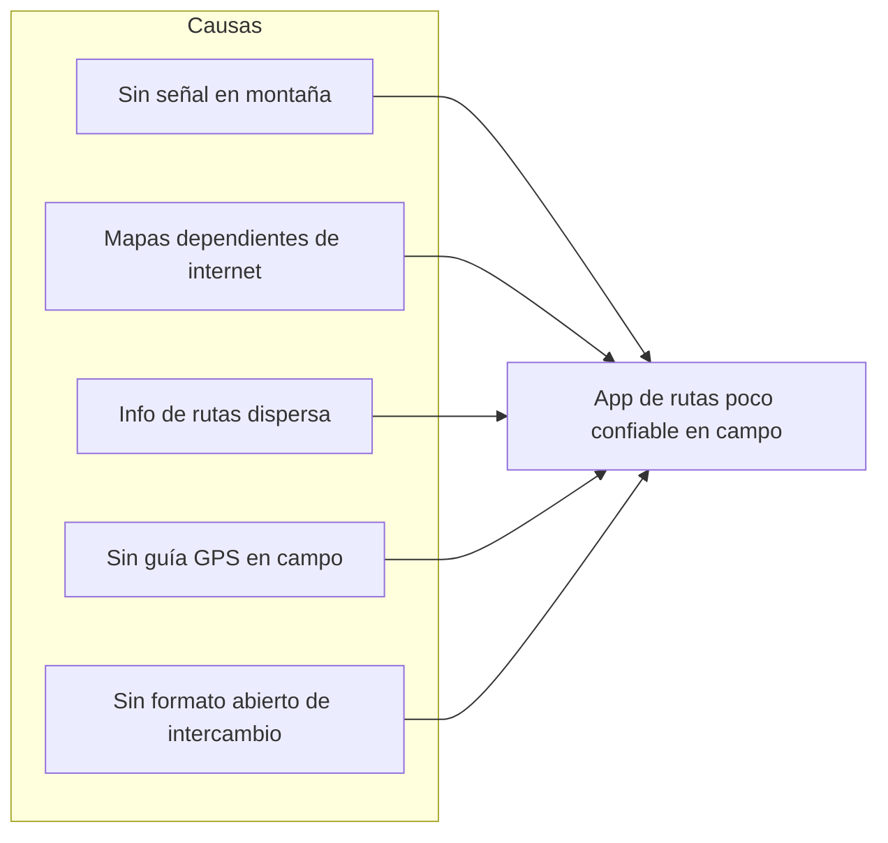

# PARTE TEÓRICA

> Capítulos 1–7 del informe formal. Prosa académica; cifras de avance solo cuando se citan HUs (fuente: `docs/USER_STORIES.md`).

---

## 1. Introducción

En la cordillera real y los valles interandinos de Bolivia, la señal celular desaparece con la altitud y la distancia. Quienes caminan, planifican excursiones o guían grupos necesitan consultar rutas, puntos de agua, desniveles y su propia posición **sin depender de una conexión a internet** que, en campo, no está garantizada.

Las aplicaciones de mapas comerciales suelen asumir conectividad constante o requieren descargas de teselas muy pesadas y poco transparentes. A la vez, no existe en el ecosistema local un espacio único que reúna rutas verificadas con información técnica (distancia, tiempo, dificultad, checkpoints) y la posibilidad de llevar ese mapa al teléfono para usarlo en modo avión.

**Trekkin App** es una aplicación móvil (Expo / React Native) que propone resolver ese problema con cuatro capacidades centrales:

1. **Catálogo público de rutas** con búsqueda, filtros y detalle técnico (HU-03).
2. **Descarga offline** de la ruta y su mapa base en un paquete por ruta (HU-04).
3. **Seguimiento y grabación con GPS** sobre el mapa, con checkpoints y exportación GPX (HU-06, HU-07, HU-08).
4. **Compartir, administrar y asegurar la comunidad** con roles y auditoría (HU-05, HU-10), sobre una base de cuentas y perfil (HU-01, HU-02).

El desarrollo se organiza con **metodología Scrum**: un Product Backlog priorizado, sprints cortos y trazabilidad entre requerimientos, historias de usuario, casos de uso y pruebas. El presente informe documenta la parte teórica del proyecto, el marco práctico (análisis y planificación Scrum) y, capítulo a capítulo de sprint, el análisis, el diseño, la implementación y las pruebas de cada iteración.

---

## 2. Planteamiento del problema

### 2.1 Identificación del problema

El problema central es la **falta de una herramienta móvil confiable para consultar y registrar rutas de montaña cuando no hay cobertura de datos**, y la ausencia de un catálogo compartido con la información técnica mínima para planificar una salida con seguridad.

Situaciones asociadas:

- El mapa o la ficha de la ruta dejan de cargarse justo cuando el usuario está en zona sin señal.
- La información de rutas (distancia, desnivel, dificultad, puntos críticos) está dispersa en documentos, grupos de mensajería o plataformas genéricas sin control de calidad.
- No hay un flujo sencillo para planificar un borrador de ruta, importar un track existente, caminarlo con GPS y exportarlo en un formato interoperable (GPX).
- La administración de usuarios y la publicación de rutas requieren roles y auditoría que una app improvisada no cubre.

### 2.2 Representación gráfica del problema

> _Figura 1._ Representación tipo Ishikawa (síntesis) del problema central de Trekkin App.

### 2.3 Pregunta de investigación

**¿De qué manera una aplicación móvil con catálogo de rutas, descarga offline de mapa base y seguimiento GPS puede mejorar la planificación, consulta y registro de caminatas en zonas sin cobertura de datos?**

---

## 3. Objetivos

### 3.1 Objetivo general

Desarrollar una aplicación móvil que permita explorar, descargar, planificar y recorrer rutas de montaña con soporte offline y registro GPS, asegurando una base de usuarios y roles para la comunidad.

### 3.2 Objetivos específicos

- Analizar los procesos actuales de consulta, planificación y registro de caminatas para identificar dificultades ligadas a la conectividad y a la dispersión de la información.
- Diseñar una arquitectura por capas (Clean Architecture con puertos) y un modelo de datos en Firestore alineado con reglas de seguridad.
- Implementar el catálogo de rutas, la autenticación y el perfil de usuario con validación en dominio (Zod).
- Implementar la descarga de paquetes offline (GPX + PMTiles), la planificación de rutas y la grabación con GPS con exportación GPX 1.1.
- Implementar la administración de usuarios y roles con bitácora de auditoría inmutable.
- Verificar el sistema con suites automatizadas y una matriz de validación en dispositivo (Expo Go / web / modo avión).

---

## 4. Justificación

### 4.1 Justificación técnica

El proyecto se justifica técnicamente por la necesidad de separar **capa de caminata** (track del usuario) y **capa de mapa base** (teselas / vector tiles), de mantener el dominio de negocio independiente de Firebase y de operar con formatos abiertos (GPX, PMTiles, GeoJSON). La arquitectura en capas (`core/domain` → `core/application` → `infrastructure` → `presentation`) con casos de uso y puertos inyectados permite sustituir proveedores sin reescribir reglas de negocio, y valida entradas con Zod en el dominio.

### 4.2 Justificación social

La app facilita la salida responsable a la montaña: consulta previa de dificultad y checkpoints, guía en campo con posición sobre el trazado y compartición de rutas con el grupo. Administra además cuentas y roles para proteger la comunidad frente a usos indebidos.

### 4.3 Justificación económica

Reduce la dependencia de soluciones comerciales con llaves de pago o modelos de descarga opacos, al usar estilos vectoriales abiertos (OpenFreeMap / OSM) y un paquete offline por ruta. El costo de operación del mapa en cliente es bajo y auditable.

---

## 5. Metodología y técnicas de investigación

### 5.1 Enfoque de investigación

El proyecto presenta un **enfoque cualitativo**: la problemática se caracterizó a partir de la experiencia del equipo con el uso de apps de mapas en campo, de la revisión de necesidades de senderismo local y de la lectura de documentación técnica de dominio (mapas offline, GPS, formatos GPX).

### 5.2 Alcance de la investigación

El alcance es **descriptivo**: se describen la situación actual del flujo de planificación y registro de caminatas, las dificultades detectadas y las necesidades que el sistema propuesto cubre, así como el estado real de implementación por historia de usuario.

### 5.3 Técnica de investigación

**Revisión documental y técnica:** análisis de fuentes abiertas (OSM, MapLibre, formato GPX), de requisitos de usuarios de senderismo y del propio código fuente del prototipo como evidencia de viabilidad.

### 5.4 Instrumento de investigación

**Guía de criterios de aceptación por historia de usuario** (plantilla en `docs/USER_STORIES.md`): cada HU define narrativa, criterios DoD y evidencia técnica. Es el instrumento de trazabilidad entre necesidad, implementación y prueba.

> **Nota de integridad académica.** Si la cátedra exige entrevistas de levantamiento, deben adjuntarse en [Anexos](05-ui-bibliografia-anexos.md) y reflejarse en el §1–§5 del marco práctico. Este borrador **no inventa** entrevistas ni nombres de entrevistados.

---

## 6. Recursos

### 6.1 Recursos humanos

- **Equipo de desarrollo (integrantes del proyecto):** análisis, diseño, implementación, pruebas y documentación.
- **Usuarios / pares evaluadores:** aportan retroalimentación en revisión de interfaz y prueba en dispositivo.
- **Docente tutor:** guía metodológica y revisión de entregables.

### 6.2 Recursos materiales

- Computadora de desarrollo.
- Teléfono móvil con Expo Go (Android/iOS) y navegador web para `http://localhost:8081`.
- Conexión a internet para desarrollo y sincronización (el modo avión se usa para pruebas offline).

### 6.3 Recursos tecnológicos

| Recurso                               | Uso                                      |
| :------------------------------------ | :--------------------------------------- |
| Expo SDK 57 + React Native            | Aplicación móvil managed workflow        |
| TypeScript estricto                   | Tipado de dominio, UI y servicios        |
| Firebase (Auth + Firestore + Storage) | Sesión, datos, reglas de seguridad       |
| Zod                                   | Validación en `core/domain`              |
| Zustand + AsyncStorage                | Estado y sesión persistente              |
| MapLibre GL + OpenFreeMap             | Mapa vectorial sin llaves de Google      |
| `expo-location` + Task Manager        | GPS en primer plano y background         |
| GPX 1.1 / PMTiles / GeoJSON           | Tracks, packs offline y capas de usuario |
| Jest (`npm test`) + `tsc --noEmit`    | Suites y lint tipado                     |

---

## 7. Marco teórico

### 7.1 Clean Architecture y puertos

El sistema separa **dominio puro** (tipos, esquemas Zod, cálculos), **casos de uso** con puertos inyectados, **infraestructura** (Firebase, storage, GPS, mapa) y **presentación** (vistas delgadas). Las dependencias apuntan hacia adentro: `presentation → infrastructure → core/{application,domain}`. El dominio no importa React Native ni Firebase.

### 7.2 Expo managed workflow

Se usa Expo en modo managed (sin eject). Los permisos de ubicación y la grabación en background se declaran en `app.json` y se prueban con `npx expo-doctor` cuando cambian dependencias nativas o permisos.

### 7.3 Autenticación y control de acceso

Firebase Auth provee registro y sesión; el rol (`user` | `admin`) y el bloqueo (`isBlocked`) se resuelven desde Firestore y se refuerzan en `firestore.rules`. No existe rol “moderador” en el alcance vigente (HU-09 fue eliminada por el equipo). Los fallbacks locales de auth solo aplican ante error de red (`isNetworkError`), nunca ante credencial inválida.

### 7.4 Mapas: una sola capa de render

`TrekMap` es el único componente de mapa. En web usa MapLibre GL JS en el DOM; en Expo Go, el mismo GL JS dentro de `react-native-webview`. El estilo base es OpenFreeMap (datos OSM, sin API keys). Quedan prohibidos `react-native-maps` y un segundo motor de mapas. El offline se resuelve con **un archivo PMTiles por ruta** más el GPX de la traza, no con miles de teselas PNG sueltas.

### 7.5 FormatOS GPS e intercambio

- **GPX 1.1:** estándar de intercambio (Garmin, Strava, Wikiloc); parseo y generación en `trackFormats.ts`.
- **GeoJSON:** capa de usuario para MapLibre (`toGeoJSON`).
- **KML / CSV:** importación complementaria.
- **PMTiles:** pack vectorial offline por ruta; se detecta con `mapPackFormats` y se pinta con `offlinePackPath`.

### 7.6 Anti-colapso de Firestore

No se persisten arrays grandes de puntos GPS ni subcolecciones `points/{chunk}` en Firestore. El detalle del track vive en el dispositivo (SQLite / AsyncStorage); en la nube van metadatos de actividad y, al finalizar, el archivo GPX (Storage) con reglas owner-only. El catálogo usa paginación con cursor (`limit` + `startAfter`).

### 7.7 Scrum (resumen metodológico)

Scrum organiza el trabajo en **Product Backlog** priorizado, **sprints** de duración fija (en este proyecto: 2 semanas), **Daily**, **Review** y **Retrospectiva**. El incremento de cada sprint debe ser potencialmente entregable. La priorización MoSCoW (Must / Should / Could / Won't) agrupa los ítems del backlog. El detalle de la planificación de Trekkin está en [02-marco-practico.md](02-marco-practico.md) y [03-sprints.md](03-sprints.md).

---

_Sigue: [02-marco-practico.md](02-marco-practico.md)._
