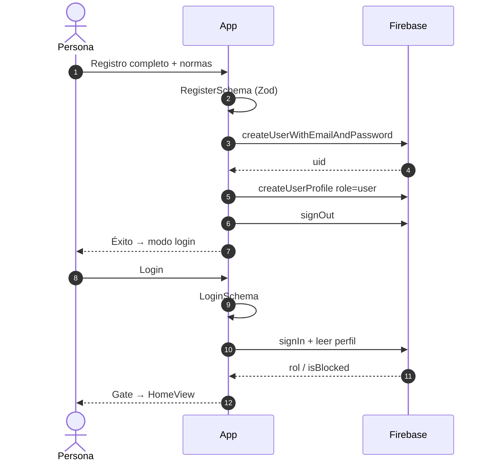
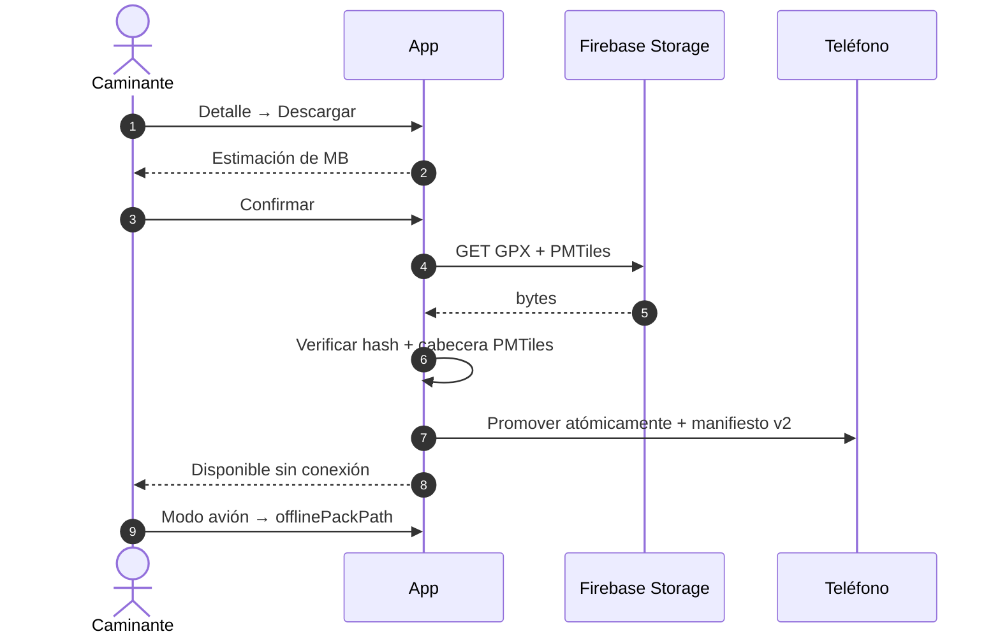
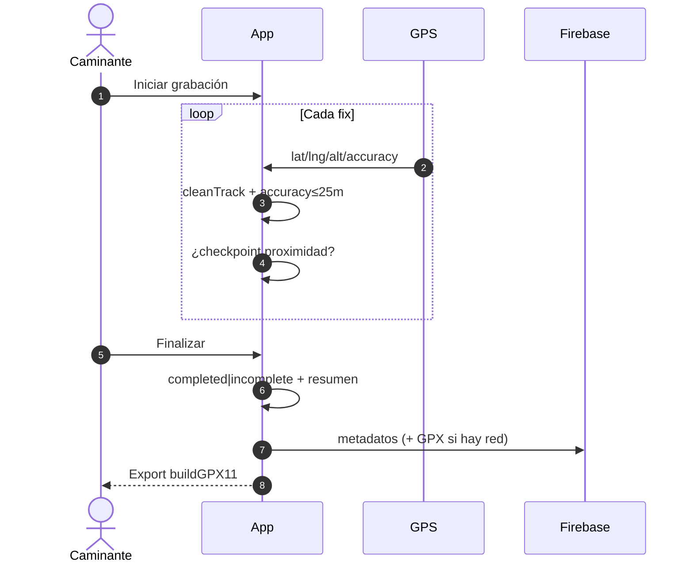
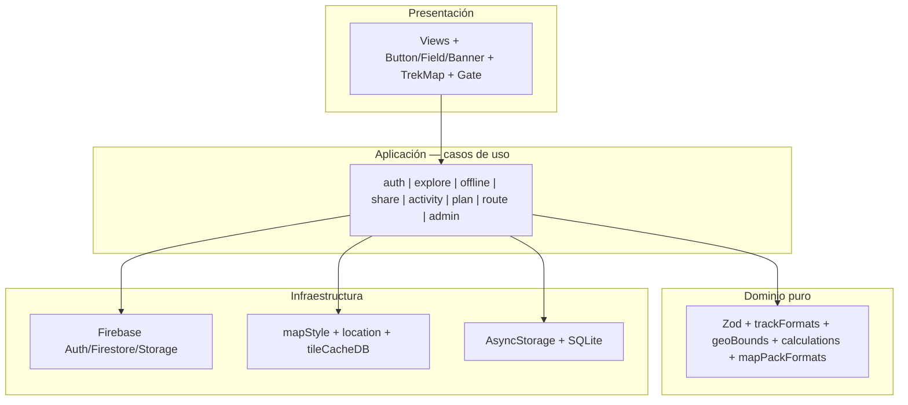
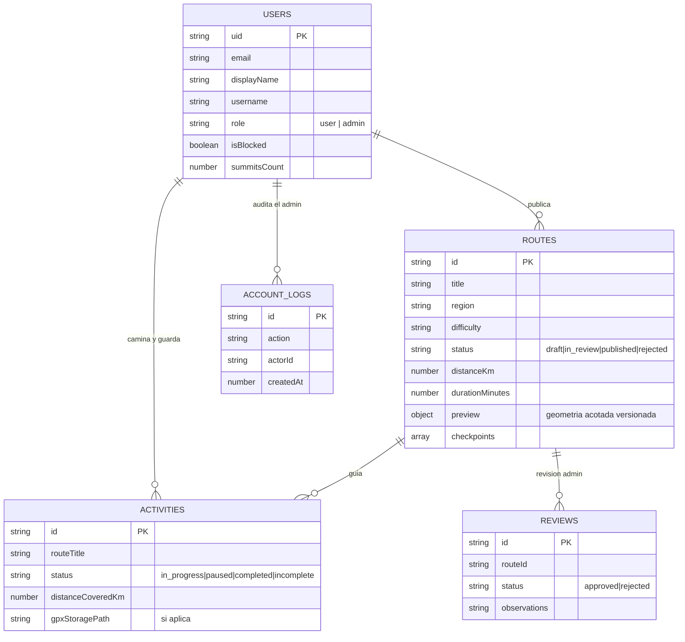

# CASOS DE USO, UML, ARQUITECTURA Y MODELO DE DATOS

---

## 1. Actores

| Código     | Actor                     | Descripción                                               |
| :--------- | :------------------------ | :-------------------------------------------------------- |
| ACT-01     | Visitante                 | Explora catálogo y detalle sin sesión (guest).            |
| ACT-02     | Senderista (usuario)      | Se registra, planifica, descarga, comparte y graba rutas. |
| ACT-03     | Administrador             | Publica/revierte, gestiona usuarios, roles y auditoría.   |
| ACT-EXT-01 | Firebase Auth / Firestore | Identidad, perfiles, rutas, actividades, logs.            |
| ACT-EXT-02 | Firebase Storage          | Archivos GPX/PMTiles de artefactos.                       |
| ACT-EXT-03 | GPS del dispositivo       | Posición y precisión para tracking / grabación.           |
| ACT-EXT-04 | MapLibre + OpenFreeMap    | Render del mapa base online / offline.                    |

Visión general:

---

## 2. Casos de uso (especificaciones)

### CU-01 — Registrar cuenta

| Campo           | Detalle                                                                                                                                                                          |
| :-------------- | :------------------------------------------------------------------------------------------------------------------------------------------------------------------------------- |
| Código          | CU-01                                                                                                                                                                            |
| Nombre          | Registrar cuenta                                                                                                                                                                 |
| Actor principal | ACT-01 Visitante                                                                                                                                                                 |
| Colaboradores   | ACT-EXT-01 Firebase                                                                                                                                                              |
| Objetivo        | Crear identidad y perfil con rol `user`                                                                                                                                          |
| Precondiciones  | Formulario completo; normas aceptadas                                                                                                                                            |
| Postcondición   | Cuenta creada; sin sesión automática; UI en modo login                                                                                                                           |
| Flujo principal | 1. Completa registro → 2. `RegisterSchema` (Zod) → 3. `createUserWithEmailAndPassword` → 4. `createUserProfile({role:'user'})` → 5. `signOut` → 6. Mensaje de éxito → modo login |
| Excepciones     | `email-already-in-use` → mensaje amigable; error de red → aviso sin crear sesión local falsa                                                                                     |

### CU-02 — Iniciar o cerrar sesión

| Campo           | Detalle                                                                                                                                                        |
| :-------------- | :------------------------------------------------------------------------------------------------------------------------------------------------------------- |
| Código          | CU-02                                                                                                                                                          |
| Nombre          | Autenticar usuario / cerrar sesión                                                                                                                             |
| Actor principal | ACT-02 (o ACT-03 con credenciales admin)                                                                                                                       |
| Colaboradores   | ACT-EXT-01                                                                                                                                                     |
| Objetivo        | Establecer o terminar sesión persistente                                                                                                                       |
| Precondiciones  | Cuenta existente                                                                                                                                               |
| Postcondición   | Sesión activa con Gate en `HomeView` o sesión purgada                                                                                                          |
| Flujo principal | 1. Credenciales → 2. `LoginSchema` → 3. `signInWithEmailAndPassword` → 4. Lee perfil (rol, `isBlocked`) → 5. Guarda `trekkin_auth_user` → 6. Gate muestra home |
| Excepciones     | Credencial inválida → error visible; `isBlocked` → mensaje “suspendida”; red caída → solo `isNetworkError` habilita estrategia de reintento local              |

### CU-03 — Explorar y consultar una ruta

| Campo           | Detalle                                                                                                                            |
| :-------------- | :--------------------------------------------------------------------------------------------------------------------------------- |
| Código          | CU-03                                                                                                                              |
| Nombre          | Explorar catálogo y ver detalle                                                                                                    |
| Actor principal | ACT-01 / ACT-02                                                                                                                    |
| Colaboradores   | ACT-EXT-01, ACT-EXT-04                                                                                                             |
| Objetivo        | Evaluar una excursión (datos + mapa)                                                                                               |
| Precondiciones  | Rutas `published` en Firestore                                                                                                     |
| Postcondición   | Detalle visible; guest sin escrituras                                                                                              |
| Flujo principal | 1. Abre Explore → 2. Paginación + filtros → 3. Toca `RouteCard` → 4. `GetRouteDetail(+Cache)` → 5. `TrekMap` con preview + markers |
| Excepciones     | Sin conexión con cache → detalle stale-while-revalidate; ruta no publicada → no listada                                            |

### CU-04 — Descargar ruta offline

| Campo           | Detalle                                                                                                                             |
| :-------------- | :---------------------------------------------------------------------------------------------------------------------------------- |
| Código          | CU-04                                                                                                                               |
| Nombre          | Descargar pack GPX + PMTiles                                                                                                        |
| Actor principal | ACT-02                                                                                                                              |
| Colaboradores   | ACT-EXT-01, ACT-EXT-02                                                                                                              |
| Objetivo        | Llevar ruta y mapa base al dispositivo                                                                                              |
| Precondiciones  | Sesión activa; par de artefactos `uploaded` y versionado                                                                            |
| Postcondición   | Manifiesto v2 local; badge disponible sin conexión                                                                                  |
| Flujo principal | 1. Detalle → Descargar → 2. Estimación de MB → 3. Confirmación → 4. Descarga + hash/cabecera → 5. Reemplazo atómico → 6. Manifiesto |
| Excepciones     | Sin par válido → botón deshabilitado; fallo de integridad → no promover archivo                                                     |

### CU-05 — Compartir ruta

| Campo           | Detalle                                                                                         |
| :-------------- | :---------------------------------------------------------------------------------------------- |
| Código          | CU-05                                                                                           |
| Nombre          | Compartir enlace de ruta                                                                        |
| Actor principal | ACT-02                                                                                          |
| Colaboradores   | Share Sheet nativo, `Linking`                                                                   |
| Objetivo        | Difundir una ruta publicada                                                                     |
| Precondiciones  | `status === 'published'`                                                                        |
| Postcondición   | Enlace `trekkin-app://r/{id}` copiado o compartido                                              |
| Flujo principal | 1. Botón compartir → 2. `ShareRoute` valida estado → 3. Modal resumen → 4. Copiar / Share Sheet |
| Excepciones     | Ruta no publicada → error tipado; sin app destino → copia al portapapeles                       |

### CU-06 — Planificar nueva ruta

| Campo           | Detalle                                                                                                                                                              |
| :-------------- | :------------------------------------------------------------------------------------------------------------------------------------------------------------------- |
| Código          | CU-06                                                                                                                                                                |
| Nombre          | Crear / editar borrador                                                                                                                                              |
| Actor principal | ACT-02                                                                                                                                                               |
| Colaboradores   | ACT-EXT-01, ACT-EXT-04, importador de archivos                                                                                                                       |
| Objetivo        | Consolidar geometría y datos antes de la expedición                                                                                                                  |
| Precondiciones  | Sesión; nombre provisional                                                                                                                                           |
| Postcondición   | Draft en Firestore + autosave local                                                                                                                                  |
| Flujo principal | 1. Drawer/Home → 2. Nombre obligatorio → 3. Trazado de waypoints sobre `TrekMap` o import GPX/KML/CSV → 4. `SaveDraft` / `UpdatePlan` → 5. Handoff `MarkReadyForGps` |
| Excepciones     | Archivo inválido → error de parseo; sin sesión → Gate                                                                                                                |

### CU-07 — Grabar ruta con GPS

| Campo           | Detalle                                                                                                                                                      |
| :-------------- | :----------------------------------------------------------------------------------------------------------------------------------------------------------- |
| Código          | CU-07                                                                                                                                                        |
| Nombre          | Grabar actividad GPS y exportar                                                                                                                              |
| Actor principal | ACT-02                                                                                                                                                       |
| Colaboradores   | ACT-EXT-03, ACT-EXT-01, ACT-EXT-02                                                                                                                           |
| Objetivo        | Medir el trayecto real y exportar GPX                                                                                                                        |
| Precondiciones  | Permiso de ubicación; plan listo o grabación libre                                                                                                           |
| Postcondición   | Actividad `completed`/`incomplete`; GPX exportable; sync metadatos                                                                                           |
| Flujo principal | 1. Iniciar → 2. Loop de `RecordPoint` (limpieza + accuracy) → 3. Checkpoints → 4. Pausa/reanudar → 5. Finalizar → 6. Resumen → 7. Export `buildGPX11` / sync |
| Excepciones     | Permiso denegado → explicación; sin red → cola local; punto `accuracy > 25 m` → descartado                                                                   |

### CU-08 — Seguir ruta existente (HU-06)

| Campo           | Detalle                                                                                                                                 |
| :-------------- | :-------------------------------------------------------------------------------------------------------------------------------------- |
| Código          | CU-08                                                                                                                                   |
| Nombre          | Seguir ruta con guía GPS                                                                                                                |
| Actor principal | ACT-02                                                                                                                                  |
| Colaboradores   | ACT-EXT-03, ACT-EXT-04                                                                                                                  |
| Objetivo        | Guiarse por el trazado oficial y chequear checkpoints                                                                                   |
| Precondiciones  | Ruta publicada o descargada; sesión                                                                                                     |
| Postcondición   | Historial de actividad                                                                                                                  |
| Flujo principal | 1. Preparar → 2. Distancia al inicio → 3. Tracking (oficial + GPS + HUD) → 4. Checkpoints proximidad → 5. Finalizar incompleta/completa |
| Excepciones     | Salida de trazado > umbral → alerta (BK-023 pendiente de pulido); background limitado por SO                                            |

### CU-09 — Finalizar y visibilidad de ruta creada

| Campo           | Detalle                                                                                                                      |
| :-------------- | :--------------------------------------------------------------------------------------------------------------------------- |
| Código          | CU-09                                                                                                                        |
| Nombre          | Cerrar plan / ruta y gestión de visibilidad                                                                                  |
| Actor principal | ACT-02 / ACT-03                                                                                                              |
| Colaboradores   | ACT-EXT-01                                                                                                                   |
| Objetivo        | Dejar el artefacto en estado coherente (`draft` / `published`)                                                               |
| Precondiciones  | Draft o rol admin                                                                                                            |
| Postcondición   | Estado actualizado; preview pública solo si `published`                                                                      |
| Flujo principal | 1. Marcar listo o enviar a revisión → 2. Admin aprueba/rechaza → 3. Publicación escribe preview y limpia waypoints completos |
| Excepciones     | Rechazo → observaciones; sin rol admin → denegado en rules                                                                   |

### CU-10 — Administrar usuarios y roles

| Campo           | Detalle                                                                                                                                                             |
| :-------------- | :------------------------------------------------------------------------------------------------------------------------------------------------------------------ |
| Código          | CU-10                                                                                                                                                               |
| Nombre          | Gestionar usuarios, bloqueos y roles                                                                                                                                |
| Actor principal | ACT-03 Administrador                                                                                                                                                |
| Colaboradores   | ACT-EXT-01                                                                                                                                                          |
| Objetivo        | Asegurar la plataforma con auditoría                                                                                                                                |
| Precondiciones  | `role === 'admin'`                                                                                                                                                  |
| Postcondición   | Usuario actualizado; `accountLogs` inmutable                                                                                                                        |
| Flujo principal | 1. Lista paginada + filtros → 2. Detalle → 3. Bloquear/desbloquear o `user`↔`admin` → 4. Confirmación modal → 5. Escritura + log `{actorId, acción, antes/después}` |
| Excepciones     | Intento de autobloqueo → rechazado; sin permiso → rules Firestore                                                                                                   |

---

## 3. Diagramas de comportamiento (secuencias de referencia)

### 3.1 Registro y sesión

### 3.2 Descarga offline y modo avión

### 3.3 Grabación GPS y export GPX

---

## 4. Arquitectura general

**Regla de dependencias:** `presentation → infrastructure → core/application → core/domain`. El dominio no importa RN ni Firebase.

---

## 5. Modelo de datos (Firestore)

### 5.1 Explicación funcional

| Colección     | Rol                                                              |
| :------------ | :--------------------------------------------------------------- |
| `users`       | Perfiles, rol RBAC, bloqueo.                                     |
| `routes`      | Catálogo; solo geometría de preview pública si `published`.      |
| `activities`  | Metadatos de caminatas; track denso local; GPX final en Storage. |
| `reviews`     | Flujo de publicación / observaciones de admin.                   |
| `accountLogs` | Bitácora inmutable de bloqueos y cambios de rol.                 |

Detalle de campos y reglas: `docs/DATABASE.md` + `firestore.rules` (fuente ejecutable).

---

_Sigue: [05-ui-bibliografia-anexos.md](05-ui-bibliografia-anexos.md)._
