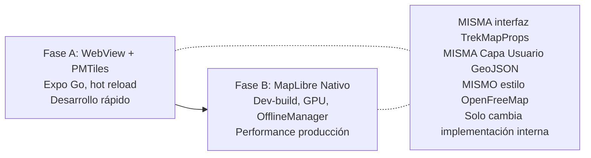
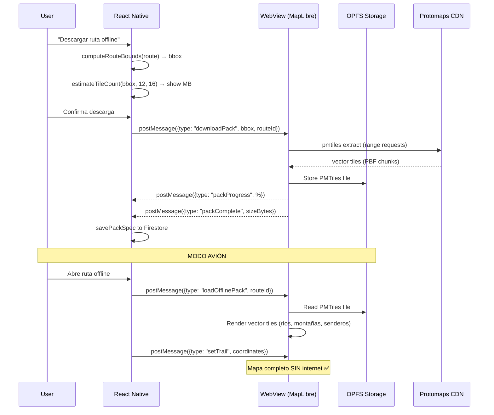

# Desbloquear Mapas Offline + Firestore — Plan v4

## La Pregunta Real: ¿Se Puede Tener Mapa Base Offline Sin Dev-Build?

La respuesta corta: **Sí, con PMTiles + MapLibre GL JS en WebView**, pero con tradeoffs que hay que entender.

La diferencia con lo que propuse en v2 (que estaba MAL) es:

```
❌ v2 (mal): Cachear tiles individuales en IndexedDB
   = descarga tile por tile del servidor → falla si no completaste → gris

✅ v4 (correcto): Descargar UN archivo PMTiles completo
   = el archivo ES el mapa empaquetado (equivalente a MBTiles)
   = ríos, montañas, curvas de nivel, TODO dentro de un solo archivo
   = OPFS lo almacena en el dispositivo
   = MapLibre GL JS lee del archivo local, NO del servidor
```

---

## Análisis Honesto de las 4 Opciones

| | MapLibre Nativo | PMTiles + WebView | react-native-maps | PlanMap actual |
|:---|:---|:---|:---|:---|
| **Expo Go** | ❌ | ✅ | ✅ | ✅ |
| **Web** | ❌ | ✅ | ❌ | ❌ |
| **Offline REAL (capa base)** | ✅ OfflineManager | ✅ PMTiles/OPFS | ❌ | ❌ (gris) |
| **Vector tiles** | ✅ GPU nativo | ✅ WebGL | ❌ raster only | ❌ PNG raster |
| **Rendimiento** | 🟢 Excelente (C++/GPU) | 🟡 Bueno (WebGL) | 🟢 Bueno | 🔴 Malo |
| **Hot reload** | ❌ rebuild | ✅ instant | ✅ instant | ✅ instant |
| **Complejidad setup** | Media (config plugin) | Media (bridge RN↔WebView) | Baja | N/A (ya existe) |
| **GPS overlay** | Nativo directo | postMessage bridge | Nativo directo | Casero frágil |
| **Gestos (pinch/pan)** | Nativo fluido | WebView fluido | Nativo fluido | PanResponder roto |
| **Offline storage** | SQLite nativo (robusto) | OPFS (Android 109+) | N/A | AsyncStorage (explota) |

### Veredicto

**PMTiles + MapLibre GL JS en WebView** es la ÚNICA opción que da:
1. ✅ Mapa base offline REAL (no línea sobre gris)
2. ✅ Funciona en Expo Go (sin rebuild para cada cambio)
3. ✅ Vector tiles con ríos, montañas, senderos
4. ✅ Compatible web

### ¿Qué es un archivo PMTiles? (para que quede claro)

```
┌─────────────────────────────────────────────────┐
│  cordillera_real_z12-z16.pmtiles (~50-150 MB)   │
│                                                  │
│  Contiene TODOS los vector tiles empaquetados:   │
│  - Ríos y lagos                                  │
│  - Montañas y relieve                            │
│  - Calles y senderos                             │
│  - Curvas de nivel                               │
│  - Nombres de lugares                            │
│  - Para zooms 12 a 16                            │
│  - En un SOLO archivo (no 8000 PNGs)             │
│                                                  │
│  Formato: Protobuf vectorial comprimido          │
│  Lectura: HTTP range requests (JS puro)          │
│  Equivalente a MBTiles pero sin necesitar SQLite  │
└─────────────────────────────────────────────────┘
```

Se genera con:
```bash
pmtiles extract https://build.protomaps.com/LATEST.pmtiles \
  cordillera_real.pmtiles \
  --bbox=-68.5,-17.0,-67.5,-15.8 \
  --minzoom=12 --maxzoom=16
```

---

## Propuesta: Estrategia Híbrida en 2 Fases



### Fase A (AHORA): PMTiles + WebView — Desarrollo Reactivo

**Para qué:** Iterar rápido, probar en Expo Go, corregir bugs al instante, validar UX con el equipo.

**Cómo funciona:**

```
┌─────────────── React Native (Expo Go) ────────────────┐
│                                                        │
│  <TrekMap trail={waypoints} markers={checkpoints} />   │
│       │                                                │
│       ▼                                                │
│  ┌─────────── WebView (DOM Component) ──────────────┐  │
│  │                                                   │  │
│  │  MapLibre GL JS                                   │  │
│  │  ├── Capa Base: PMTiles via OPFS (offline real)   │  │
│  │  │   └── cordillera_z12-16.pmtiles (local)        │  │
│  │  └── Capa Usuario: GeoJSON overlay                │  │
│  │      └── trail + markers via postMessage          │  │
│  │                                                   │  │
│  └───────────────────────────────────────────────────┘  │
│                                                        │
│  Bridge: postMessage para datos, injectJS para control │
└────────────────────────────────────────────────────────┘
```

**Tradeoffs honestos de la Fase A:**

| Aspecto | Impacto | Mitigación |
|:---|:---|:---|
| Rendimiento WebGL vs GPU nativo | ~20-30% más lento en pan/zoom pesado | Suficiente para trekking (mapas estáticos con trail) |
| Bridge postMessage para GPS | Latencia ~50ms por update | Debounce a 1 update/s (track no necesita 60fps) |
| OPFS requiere Android WebView 109+ | Dispositivos viejos (pre-2023) no soportan | Validar versión, fallback a online |
| Archivo PMTiles por ruta (~10-50MB) | Espacio en disco | Gestión de packs: descargar/borrar por ruta |
| Gestos compiten con ScrollView | Posible conflicto touch | `nestedScrollEnabled={false}` en WebView zone |

### Fase B (CUANDO ESTABILICE): MapLibre Nativo

**Para qué:** Performance de producción. Un solo rebuild cuando la app esté estable.

**Cuándo:** Cuando las 3 entregas estén validadas y los devs no necesiten hot-reload para el mapa.

**Cambio:** Solo la implementación interna de `TrekMap`. Los consumidores (`RouteDetailView`, `TrackingView`, etc.) NO cambian.

---

## Arquitectura del Map Service (Fase A)

### Contrato Compartido (NO cambia entre fases)

```typescript
// src/presentation/components/map/TrekMap.types.ts
// Este contrato es ESTABLE — los devs programan contra esto

export interface TrekMapProps {
  /** Capa Usuario: trazado de la ruta (GeoJSON LineString). */
  trail?: Coordinates[];
  /** Capa Usuario: marcadores (inicio, fin, checkpoints). */
  markers?: MapMarker[];
  /** Bounding box para fit automático [w,s,e,n]. */
  bounds?: [number, number, number, number];
  /** Habilitar taps para agregar puntos (HU-07). */
  interactive?: boolean;
  /** Callback de tap con coordenadas. */
  onPress?: (coords: { lat: number; lng: number }) => void;
  /** Mostrar posición GPS del usuario (HU-06/08). */
  showUserLocation?: boolean;
  /** ID de la ruta para cargar pack offline si existe. */
  offlineRouteId?: string;
}

export interface MapMarker {
  id: string;
  lat: number;
  lng: number;
  type: "start" | "end" | "checkpoint" | "user";
  label?: string;
  category?: CheckpointCategory;
}
```

### Implementación Fase A

```
src/
├── core/domain/
│   ├── geoBounds.ts              [NEW]  Bbox dinámico + tile count (puro)
│   └── packSpec.ts               [NEW]  Tipo PackSpec (puro)
│
├── infrastructure/map/
│   ├── mapStyle.ts               [NEW]  Config estilo OpenFreeMap
│   ├── offlinePacks.ts           [REWRITE] Descarga PMTiles + OPFS
│   └── mapBridge.ts              [NEW]  Bridge RN ↔ WebView (postMessage)
│
├── presentation/components/map/
│   ├── TrekMap.types.ts          [NEW]  Contrato compartido
│   ├── TrekMap.tsx               [NEW]  Wrapper: exporta implementación activa
│   ├── TrekMapWebView.tsx        [NEW]  Fase A: MapLibre GL JS en WebView
│   ├── trekmap.html              [NEW]  HTML que corre dentro del WebView
│   ├── PlanMap.tsx               [DEPRECATED] Se deja, no se importa
│   ├── OfflineRouteMap.tsx       [DEPRECATED]
│   └── mercator.ts               [DEPRECATED]
```

### Bridge RN ↔ WebView

```typescript
// src/infrastructure/map/mapBridge.ts
// Protocolo de mensajes entre React Native y el WebView del mapa

export type MapCommand =
  | { type: "setTrail"; payload: { coordinates: [number, number][] } }
  | { type: "setMarkers"; payload: { markers: MapMarker[] } }
  | { type: "fitBounds"; payload: { bounds: [number, number, number, number] } }
  | { type: "setUserLocation"; payload: { lat: number; lng: number; accuracy: number } }
  | { type: "loadOfflinePack"; payload: { packUrl: string } };

export type MapEvent =
  | { type: "mapPress"; payload: { lat: number; lng: number } }
  | { type: "mapReady" }
  | { type: "packProgress"; payload: { percentage: number } }
  | { type: "error"; payload: { message: string } };
```

---

## Entrega 1: Map Service con PMTiles (F0)

> **Runtime:** Expo Go ✅ + Web ✅
> **Esfuerzo:** ~5 días dev (1 día extra por bridge WebView)

### Archivos nuevos

#### [NEW] `src/core/domain/geoBounds.ts`
Cálculo de bounding box puro (sin deps):
- `computeRouteBounds(points)` → `[w, s, e, n]` con buffer 15%
- `estimateTileCount(bounds, minZoom, maxZoom)` → número de tiles
- `AVG_VECTOR_TILE_BYTES = 30 * 1024`

#### [NEW] `src/infrastructure/map/mapStyle.ts`
Config centralizada: `STYLE_URL`, `ATTRIBUTION`, zooms offline

#### [NEW] `src/presentation/components/map/TrekMap.types.ts`
Contrato de props (estable entre fases)

#### [NEW] `src/presentation/components/map/trekmap.html`
HTML autocontenido que inicializa MapLibre GL JS:
- Carga `maplibre-gl.js` + `pmtiles.js` (bundled o CDN)
- Registra protocolo `pmtiles://`
- Escucha `postMessage` para trail/markers/bounds/GPS
- Emite eventos `mapPress`, `mapReady`, etc.
- Estilo OpenFreeMap (online) o PMTiles local (offline)

#### [NEW] `src/presentation/components/map/TrekMapWebView.tsx`
Componente React Native que wrappea el HTML:
- `<WebView source={{ html: trekMapHtml }}>`
- Recibe props `TrekMapProps` → traduce a `MapCommand` → `postMessage`
- Escucha `MapEvent` → invoca callbacks (`onPress`, etc.)
- GPS: recibe location de `expo-location` → `setUserLocation` command

#### [NEW] `src/presentation/components/map/TrekMap.tsx`
Wrapper limpio que exporta la implementación activa:
```typescript
// Fase A: WebView
export { default as TrekMap } from "./TrekMapWebView";
// Fase B: cambiar a:
// export { default as TrekMap } from "./TrekMapNative";
```

#### [NEW] `src/infrastructure/map/mapBridge.ts`
Tipos del protocolo de comunicación RN ↔ WebView

### Archivos modificados

#### [MODIFY] Vistas que consumen `<TrekMap>`
- `RouteDetailView` → agrega `<TrekMap trail={...} bounds={...} />`
- `CreateRouteView` / `PlanEditorView` → `<TrekMap interactive onPress={...} />`
- `PrepareView` / `TrackingView` → `<TrekMap trail={...} showUserLocation />`

#### [MODIFY] `package.json`
```diff
+ "react-native-webview": "^13.x"    # ya incluido en Expo Go SDK 57
```
No se necesita `maplibre-gl` en package.json del proyecto — va bundled en el HTML.

#### Deprecados (se dejan, no se borran)
`PlanMap.tsx`, `OfflineRouteMap.tsx`, `mercator.ts`, `tileCache.ts`, `tileCacheDB.ts`

---

## Entrega 2: Offline Packs con PMTiles (F1 — BK-010/011/012)

> **Runtime:** Expo Go ✅
> **Esfuerzo:** ~3.5 días dev

### Flujo de descarga offline



### Archivos

#### [NEW] `src/core/domain/packSpec.ts`
Tipo `PackSpec` (bounds, zooms, size, downloadedAt)

#### [NEW] `src/core/application/offline/CreatePack.usecase.ts`
Use case puro con puertos para descargar PMTiles

#### [NEW] `src/core/application/offline/DeletePack.usecase.ts`
Borrado de pack

#### [NEW] `src/core/application/offline/InvalidatePack.usecase.ts`
`isPackStale(routeUpdatedAt, packDownloadedAt)` → badge "desactualizada"

#### [MODIFY] `src/infrastructure/map/offlinePacks.ts`
Reescritura: implementa puertos via bridge WebView + OPFS

#### [MODIFY] `src/core/application/offline/EstimateRouteDownloadSize.usecase.ts`
Fórmula real: `bbox × zooms 12–16 × ~30KB/tile`

#### [MODIFY] `routeService.ts`
Agregar `updatePackSpec` / `clearPackSpec` para `routes/{id}.packSpec`

---

## Entrega 3: Firestore Anti-Colapso (F3 — BK-030/031)

> **Runtime:** Expo Go ✅ (sin dependencia de mapa)
> **Esfuerzo:** ~3 días dev

Sin cambios vs plan v3 — esta entrega no toca mapas:

- **Paginación cursor `limit(20)`** en `routeService.ts`
- **Chunked points subcollection** en `activityService.ts`
- **`persistentLocalCache`** en `config.ts`
- **Fix `firestore.rules`** (allow list + subcollection points)
- **`recordedPoints` → opcional** en `types.ts`

---

## Riesgos de la Fase A y Mitigación

| Riesgo | Probabilidad | Impacto | Mitigación |
|:---|:---|:---|:---|
| OPFS no soportado en dispositivo viejo | Baja (Android WebView 109+ = 2023) | Pack offline no funciona | Detectar versión, fallback a online con mensaje |
| Bridge postMessage lento para GPS tracking | Media | Latitud del GPS update | Throttle a 1 update/s (suficiente para trekking) |
| PMTiles grandes (>100MB) en OPFS | Baja | Tiempo de descarga largo | Limitar zooms 12–16, mostrar progreso con cancel |
| Touch conflicts WebView vs ScrollView | Media | UX rota en scroll | Zona de mapa sin scroll, `nestedScrollEnabled` |
| Secure context para OPFS en WebView | Media | OPFS no accesible | Servir HTML como data URI o localhost |

### Plan B si WebView no funciona

Si OPFS falla en los dispositivos del equipo:
1. Se hace UN solo dev-build con MapLibre nativo
2. Todo el bridge/contrato `TrekMapProps` sigue igual
3. Solo se cambia `TrekMapWebView` → `TrekMapNative`
4. Las 3 entregas de lógica (geoBounds, packSpec, Firestore) se reusan 100%

**Nada del domain/application se pierde** — todo es puro y portable.

---

## Orden de Ejecución

```
Entrega 1 (Map Service WebView)  ──→  Entrega 2 (Offline PMTiles)
                                              │
Entrega 3 (Firestore)  ──────────────────────→ ↓
  (paralelizable con E1)              Devs desbloqueados
                                      Hot reload en Expo Go ✅
```

## Verification Plan

### Expo Go (sin rebuild)
```bash
npm run lint          # 0 errores
npm test              # suites existentes + nuevos tests geoBounds/packSpec
npm start             # Expo Go → TrekMap renderiza vectorial
```

### Manual
| Test | Resultado esperado |
|:---|:---|
| Abrir RouteDetail con `<TrekMap>` en Expo Go | Mapa vectorial con ríos, calles, relieve. Zoom 14–16 nítido |
| Descargar PMTiles de una ruta → modo avión | Mapa base COMPLETO offline (no gris). Trail GeoJSON encima |
| Tap en mapa (modo planificación) | `onPress` callback con lat/lng correctos |
| GPS tracking con mapa | Posición actualiza cada 1s via bridge |
| 50 rutas seed → scroll lista | Carga <1s con cursor, sin timeout |
| Track 2h → guardar | Chunks en subcollection, sin QuotaExceeded |
