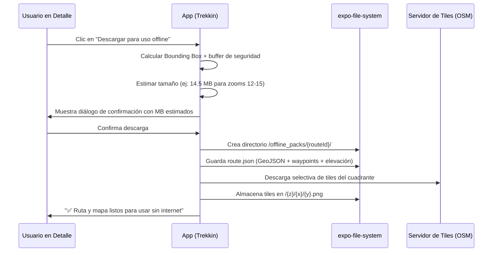

# Plan Maestro de Mapas, Formatos GPS y Firestore — Trekkin App (v6)

## 1. Visión y Corrección Arquitectónica

Tenés toda la razón: **estábamos sobre-complejizando la visualización con WebViews innecesarias y borrando la riqueza funcional del backlog**.

La separación conceptual debe ser limpia y pragmática:

```
┌─────────────────────────────────────────────────────────────────────────────┐
│ 1. CATÁLOGO (HU-03 Lista)                                                   │
│    • Foto referencial de portada subida por el usuario (o Andean cover)     │
│    • Datos clave: Distancia, Desnivel, Tiempo estimado, Dificultad          │
│    • Consumo: 0 MB de mapa, 0 tiles, carga instantánea a 60 FPS             │
├─────────────────────────────────────────────────────────────────────────────┤
│ 2. DETALLE DE RUTA (HU-03 Detalle)                                          │
│    • Mapa ONLINE NATIVO en pantalla sin WebViews pesadas                    │
│    • iOS: Apple Maps nativo (100% GRATIS, 0 API keys)                      │
│    • Android / Expo Go: react-native-maps + OpenStreetMap (OSM) / libre    │
│    • Dibuja: Polyline del trazado + Marcadores de checkpoints               │
│    • Botón explícito: [ 📥 Descargar para usar sin internet ]               │
├─────────────────────────────────────────────────────────────────────────────┤
│ 3. DESCARGA OFFLINE & EN EL TERRENO (HU-04, HU-06, HU-07, HU-08)             │
│    • La descarga se activa SOLO si el usuario la solicita para ir al campo  │
│    • Guarda: Track completo (GPX/GeoJSON) + Waypoints + Altimetría          │
│    • Guarda: Paquete de mapa base de la zona en almacenamiento local        │
│    • Desbloquea: Grabación en vivo (HU-08), Seguir ruta (HU-06) y Modo Avión│
├─────────────────────────────────────────────────────────────────────────────┤
│ 4. ROADMAP CLARO V1 vs V2                                                   │
│    • V1 (Expo Go): react-native-maps (OSM/Apple Maps) + tiles offline local │
│      Desarrollo reactivo sin rebuilds, desbloqueo total del equipo          │
│    • V2 (Nativo): Dev-build con @maplibre/maplibre-react-native y GPU       │
└─────────────────────────────────────────────────────────────────────────────┘
```

---

## 2. Mapa de Trazabilidad con el Backlog (`BACKLOG.md`)

Restauramos y consolidamos **toda** la lógica funcional del backlog sin dejar nada afuera:

| Módulo | Tareas Backlog | Alcance Funcional en V1 |
| :--- | :--- | :--- |
| **F0: Map Service Nativo** | BK-002, BK-003, BK-004 | `TrekMap.tsx` nativo con `react-native-maps` + OSM (Android) / Apple Maps (iOS). Retiro de código muerto (`tileCache.ts` base64 y PNGs obsoletos). |
| **F1: Offline Real** | BK-010, BK-011, BK-012, BK-013, BK-014 | `packSpec` en Firestore, estimación de descarga por bounding box, descarga a `expo-file-system`, modo avión sin pantalla gris, manejo de cuota y progreso. |
| **F2: Formatos GPS** | BK-020, BK-021, BK-022, BK-023 | `trackFormats.ts` puro: parse/build GPX 1.1, KML/KMZ, TCX, CSV, GeoJSON + Douglas-Peucker. Importación con picker y exportación con `expo-sharing` para Garmin/Wikiloc. Tracking con snap to polyline y alerta de desvío >50m. |
| **F3: Firestore Anti-Colapso** | BK-030, BK-031, BK-032, BK-033 | Catálogo paginado con cursor `limit(20)`, track completo solo en detalle, chunks de puntos `points/{chunk}` en subcolección, persistencia local offline de Firestore. |
| **F4: Integración HU** | BK-040, BK-041, BK-042 | Catálogo enlazado a detalle y preparación, edición de ruta con undo/clear/drag, perfil y administración limpia. |

---

## 3. Arquitectura Detallada por Entrega

### Entrega 1: Visualización Nativa y Catálogo (HU-03)

#### A. Catálogo con Imágenes de Usuario
- Las rutas en Firestore contienen:
  ```typescript
  export interface RouteSummary {
    id: string;
    title: string;
    coverImageUrl?: string; // Foto real subida por el usuario
    difficulty: "easy" | "moderate" | "hard" | "expert";
    distanceKm: number;
    durationMin: number;
    elevationGainM: number;
    startPointName: string;
  }
  ```
- En el catálogo (`ExploreView` / `RouteCard`):
  - Renderiza `<Image source={{ uri: route.coverImageUrl || DEFAULT_ANDEAN_COVER }} />`.
  - Cero llamadas a APIs de mapas, cero WebViews.

#### B. Componente `<TrekMap />` Nativo (V1)
- Usa `react-native-maps` (ya compatible al 100% con Expo Go):
  - **iOS:** Renderiza con Apple Maps nativo por defecto (0 configuración, 0 API key, gratis, fluido).
  - **Android:** Usa `<UrlTile urlTemplate="https://tile.openstreetmap.org/{z}/{x}/{y}.png" />` o tiles libres de OpenFreeMap/CartoDB (sin requerir Google Maps API Key de pago).
  - **Capas:** `<Polyline coordinates={trail} strokeColor="#E07A5F" strokeWidth={4} />` y `<Marker />` para inicio, fin y checkpoints.
  - **Contrato unificado (`TrekMap.types.ts`):**
    ```typescript
    export interface TrekMapProps {
      trail?: Coordinates[];
      markers?: MapMarker[];
      interactive?: boolean;
      onPress?: (coords: { lat: number; lng: number }) => void;
      showUserLocation?: boolean;
      offlinePackPath?: string; // Si está presente, carga tiles locales
      style?: StyleProp<ViewStyle>;
    }
    ```

---

### Entrega 2: Capa Usuario y Formatos GPS (HU-07, HU-08, HU-05, HU-06)

Dominio 100% puro en TypeScript (sin dependencias nativas):

#### A. `src/core/domain/trackFormats.ts` (BK-020)
- **GPX 1.1 Canónico:**
  - `parseGPX(xmlString): Track`: extrae waypoints (`<wpt>`), track points (`<trkpt>`), elevación (`<ele>`), timestamps (`<time>`).
  - `buildGPX(track): string`: serializa a estándar GPX 1.1 para interoperabilidad con Garmin, Wikiloc y Strava.
- **Otros formatos soportados:**
  - `parseKML(kmlString): Track` y soporte KMZ vía descompresión.
  - `parseTCX(tcxString): Track`.
  - `parseCSV(csvString): Track` (lat, lon, ele, time).
- **Algoritmos de optimización:**
  - `simplifyTrack(points, toleranceMeters)` usando **Ramer-Douglas-Peucker**: reduce tracks de 10.000 puntos a 500 sin perder la geometría esencial.
  - `computeElevationStats(points)`: calcula ganancia/pérdida de elevación y perfil altimétrico.

#### B. Importación y Exportación (BK-021, BK-022)
- `ImportTrackFile.usecase.ts`: usa `expo-document-picker` para cargar un archivo `.gpx`/`.kml`/`.tcx`, validarlo con Zod y cargarlo en el planificador (HU-07) o para unirse a una salida existente.
- `ExportTrackFile.usecase.ts`: genera el archivo `.gpx` y lanza `expo-sharing` para enviarlo a compañeros o guardarlo.

#### C. Algoritmos de Campo y Guía (BK-023 — HU-06)
- `projectOnPolyline(currentPos, polyline)`: calcula la distancia perpendicular al sendero.
- `checkOffRoute(currentPos, polyline, thresholdMeters = 50)`: alerta sonora/visual si el caminante se sale del camino más de 50 metros.
- `checkCheckpointsReached(currentPos, checkpoints, radiusMeters = 30)`: detecta llegada a fuentes de agua, campamentos o puntos de control.

---

### Entrega 3: Descarga Offline y Modo Campo (HU-04, HU-06, HU-08)

La descarga offline es un proceso consciente y empaquetado:



#### A. Almacenamiento y `packSpec` (BK-010, BK-011, BK-012)
- En Firestore, cada ruta tiene metadata de su paquete:
  ```typescript
  export interface PackSpec {
    packId: string;
    bounds: [number, number, number, number]; // [minLng, minLat, maxLng, maxLat]
    minZoom: number;
    maxZoom: number;
    sizeBytes: number;
    tileCount: number;
    version: number;
    updatedAt: string;
  }
  ```
- Si la ruta es editada por su autor posterior a la descarga del usuario (`route.updatedAt > pack.downloadedAt`), la app marca el badge: `"⚠️ Mapa desactualizado"`.

#### B. Grabación en Terreno y Modo Avión (BK-013, BK-033)
- Cuando el usuario entra en `PrepareView` o `TrackingView`:
  - Si el pack offline está presente, `TrekMap` usa la ruta local (`offlinePackPath`) para cargar los tiles desde el disco local.
  - Si no está descargado y hay red, ofrece descargarlo antes de iniciar.
  - Si no hay red ni pack, la app **no se cuelga ni se pone gris**: muestra el track del GPS sobre una cuadrícula técnica con orientación, altitud y distancia.
- GPS en background (`BK-033`): configuración con `expo-location` con `Accuracy.High` y descarte de lecturas con `accuracy > 25m`.

---

### Entrega 4: Firestore Anti-Colapso (BK-030, BK-031, BK-032)

Protegemos la cuota gratuita de Firestore y la memoria del dispositivo:

1. **Paginación en Catálogo (BK-030):**
   - En `routeService.ts`: consultas con `limit(20)` y paginación por cursor (`startAfter(lastVisible)`).
   - Los documentos de ruta en la lista principal solo traen la metadata liviana y la URL de portada. **El array pesado de puntos no se incluye en el documento de resumen**.

2. **Subcolección Chunked para Actividades Largas (BK-030):**
   - En `activityService.ts`: una actividad de 6 horas con 15.000 puntos GPS no se guarda en un solo documento (rompería el límite de 1 MB de Firestore).
   - Se guardan los puntos en subcolecciones en bloques de 500 puntos:
     `activities/{activityId}/points/{chunkIndex}`.

3. **Caché Offline Persistente (BK-031):**
   - Activación de `persistentLocalCache` en `src/infrastructure/firebase/config.ts` para que Firestore guarde automáticamente en disco local las rutas visitadas.

---

## 4. Estructura de Archivos a Modificar / Crear

```
src/
├── core/
│   ├── domain/
│   │   ├── trackFormats.ts               [NEW]  Parsers GPX, KML, TCX, CSV + Ramer-Douglas-Peucker
│   │   ├── geoBounds.ts                  [NEW]  Cálculo de bounding box y estimación de tiles
│   │   └── packSpec.ts                   [NEW]  Tipos y reglas de validación de paquetes offline
│   └── application/
│       ├── offline/
│       │   ├── DownloadRoutePack.usecase.ts  [NEW]  Orquesta descarga de track + tiles
│       │   ├── DeleteRoutePack.usecase.ts    [NEW]  Liberación de espacio en disco
│       │   └── EstimatePackSize.usecase.ts   [NEW]  Cálculo de MB antes de descargar
│       └── tracking/
│           ├── ImportTrackFile.usecase.ts    [NEW]  Picker de archivos y parsing
│           ├── ExportTrackFile.usecase.ts    [NEW]  Generación de GPX y share
│           └── GuideTracker.ts               [NEW]  Off-route (>50m) y detección de checkpoints
│
├── infrastructure/
│   ├── map/
│   │   ├── tileDownloader.ts             [NEW]  Descarga de tiles a expo-file-system
│   │   └── mapTileConfig.ts              [NEW]  URLs de OSM/Apple Maps sin keys de pago
│   ├── database/
│   │   ├── routeService.ts               [MODIFY] Paginación cursor limit(20)
│   │   └── activityService.ts            [MODIFY] Chunked subcollections points/{chunk}
│   └── firebase/
│       └── config.ts                     [MODIFY] persistentLocalCache
│
└── presentation/
    ├── components/
    │   ├── map/
    │   │   ├── TrekMap.types.ts          [NEW]  Contrato de props
    │   │   ├── TrekMap.tsx               [NEW]  react-native-maps + OSM/Apple Maps
    │   │   └── OfflineDownloadModal.tsx  [NEW]  Diálogo de confirmación con MB y progreso
    │   └── route/
    │       └── RouteCard.tsx             [MODIFY] Portada subida por usuario (0 tiles)
    └── views/
        ├── explore/RouteDetailView.tsx   [MODIFY] Integra TrekMap nativo + botón offline
        ├── plan/CreateRouteView.tsx      [MODIFY] Edición interactiva + aviso pre-terreno
        └── record/TrackingView.tsx       [MODIFY] Navegación guiada con alerta de desvío
```

---

## 5. Plan de Verificación

### Pruebas Automatizadas (`npm test` y `npm run lint`)
1. **Parsers GPS:** pruebas unitarias con archivos reales `.gpx`, `.kml`, `.tcx` y `.csv` verificando integridad de coordenadas y elevación.
2. **Douglas-Peucker:** prueba de reducción de puntos manteniendo el cálculo de distancia con un margen < 2%.
3. **Bounding Box y Estimación:** validación matemática de cantidad de tiles por zooms 12 a 15.
4. **Lint:** `npm run lint` en 0 errores.

### Pruebas Manuales en Expo Go
1. **Catálogo:** abrir la lista de rutas y verificar que se muestran las fotos de portada de los usuarios de inmediato sin llamadas a servidores de mapas.
2. **Detalle de Ruta:** entrar al detalle y comprobar que el mapa abre en segundos con el trazado nítido (Apple Maps en iOS, OSM en Android).
3. **Descarga Offline:** tocar el botón de descarga, ver el progreso y tamaño descargado. Activar Modo Avión y comprobar que la ruta abre con sus puntos y mapa base.
4. **Planificación y Guía:** simular recorrido con GPS y verificar que detecta el desvío cuando la posición se aleja más de 50m del camino.
